# Awesome Website Prompts & Skills

  我们致力于将 <b>Awesome Website Prompts & Skills</b> 打造成 AI 建站时代最有用的一份资源合集，也作为 <b>WorkBuddy × Tencent EdgeOne AI Prompts × Skills 挑战赛</b> 的官方作品池。更多的 Star 能让这个项目被更多开发者看到，也能直接影响参赛者的最终奖励——<b>GitHub Star 破 1000 后，所有获奖者 Credit 奖励全线 +10%</b>。您的 Star 对我们至关重要！

  

  <a href="https://edgeone.ai/awesome-website-prompts-and-skills">🏆 在线作品集</a> ·
  <a href="https://pages.edgeone.ai/">🌐 EdgeOne Pages 官网</a> ·
  <a href="https://discord.gg/3EvPueMt4K">💬 Discord 社区</a> ·
  <a href="mailto:edgeonedeveloper@tencent.com">📨 邮箱</a>

---

## 📖 这个仓库是什么

这个仓库是 **Tencent EdgeOne** 维护的**网站资源合集**，同时也是「**WorkBuddy × Tencent EdgeOne AI Prompts × Skills 挑战赛**」的官方作品池——目前收录了 **166** 件来自全球开发者的作品（**116** 个 Prompt + **50** 个 Skill）。

在 AI 编程工具中，给它一个 Prompt 或一个 Skill——

就能生成一个**精美酷炫的网页**（Prompt），或者带有**登录、支付、AI 能力**的完整网站（Skill）。

 

仓库中包含两类资产：

| 类型 | 是什么 | 怎么用 |
|:---|:---|:---|
| **Prompts** | 直接喂给 AI 编程工具的**建站提示词** | 复制 Prompt → 粘贴给 AI → AI 帮你生成并部署完整网站 |
| **Skills** | 遵循 [Anthropic Skills 规范](https://www.anthropic.com/news/claude-skills) 的**可复用建站能力包**，封装了特定类型网站的搭建 SOP | 安装 Skill → 一句话触发 → AI 按 SOP 搭站并使用到 EdgeOne Pages 的网站开发和部署能力 |

仓库里所有作品都通过 [EdgeOne Pages](https://pages.edgeone.ai/) 部署，开箱即拥有 **全球 CDN 加速 + 安全防护**，并可按需接入登录、支付、AI 等后端服务。

> 💡 想直接用上某个作品？跳到下方 [Prompts](#-prompts-赛道116-件) 或 [Skills](#-skills-赛道50-件) 画廊点击封面，即可查看完整内容并一键复刻同款网站。

---

## 📦 仓库内容速览

### 🎬 Prompts 赛道（116 件）

> 点击封面 → 跳转作品详情页查看完整 Prompt 与 demo 动图

<table>
  <tr>
    <td align="center" width="25%" valign="top">
      <a href="./prompts/pawsome.md">
        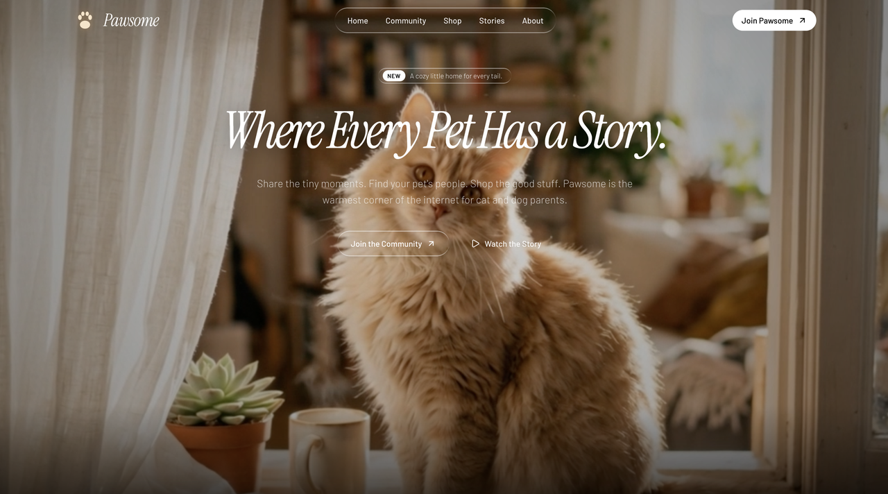
         <b>Pawsome</b>
      </a>
       EdgeOne
    </td>
    <td align="center" width="25%" valign="top">
      <a href="./prompts/luxury-perfume.md">
        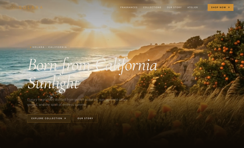
         <b>luxury perfume</b>
      </a>
       EdgeOne
    </td>
    <td align="center" width="25%" valign="top">
      <a href="./prompts/lumina-walls.md">
        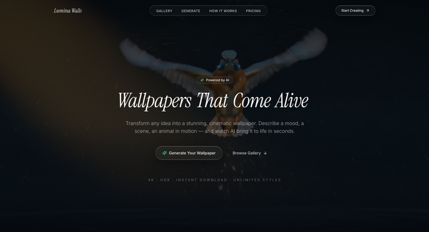
         <b>AI wallpaper generator</b>
      </a>
       EdgeOne
    </td>
    <td align="center" width="25%" valign="top">
      <a href="./prompts/start-somewhere.md">
        
         <b>Start Somewhere</b>
      </a>
       EdgeOne
    </td>
  </tr>
  <tr>
    <td align="center" width="25%" valign="top">
      <a href="./prompts/drama-ai.md">
        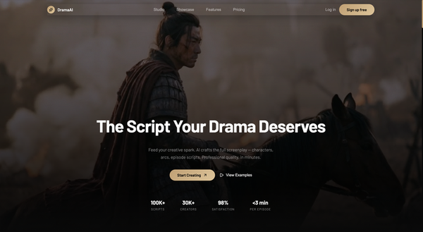
         <b>DramaAI</b>
      </a>
       EdgeOne
    </td>
    <td align="center" width="25%" valign="top">
      <a href="./prompts/maison-perle.md">
        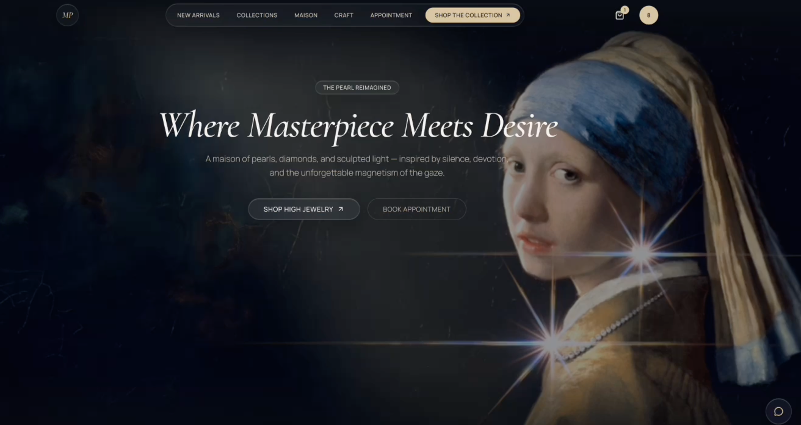
         <b>Maison Perle</b>
      </a>
       EdgeOne
    </td>
    <td align="center" width="25%" valign="top">
      <a href="./prompts/hui-hu-xi-de-shu-zi-xuan-zhi.md">
        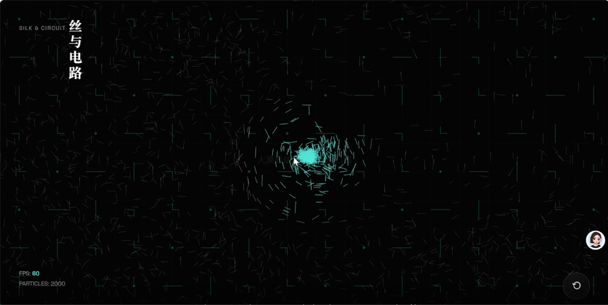
         <b>会呼吸的"数字宣纸"</b>
      </a>
       lukas
    </td>
    <td align="center" width="25%" valign="top">
      <a href="./prompts/shi-pin-du-li-wang-zhan.md">
        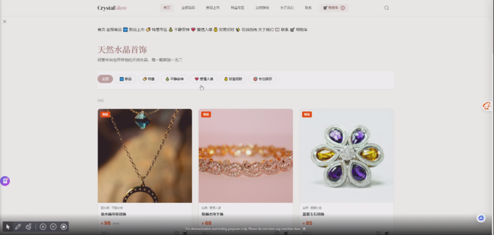
         <b>饰品独立网站</b>
      </a>
       winna
    </td>
  </tr>
  <tr>
    <td align="center" width="25%" valign="top">
      <a href="./prompts/productlens.md">
        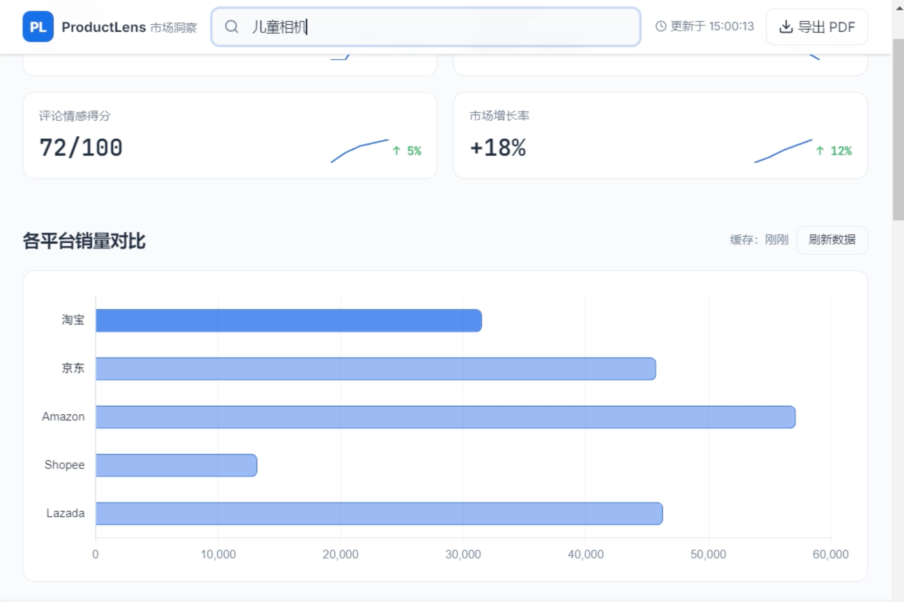
         <b>ProductLens</b>
      </a>
       临渊不羡鱼
    </td>
    <td align="center" width="25%" valign="top">
      <a href="./prompts/qing-xu-tiao-se-pan.md">
        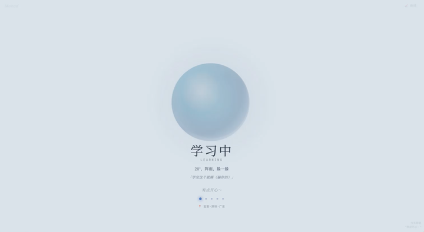
         <b>情绪调色盘</b>
      </a>
       ahu
    </td>
    <td align="center" width="25%" valign="top">
      <a href="./prompts/maison-table.md">
        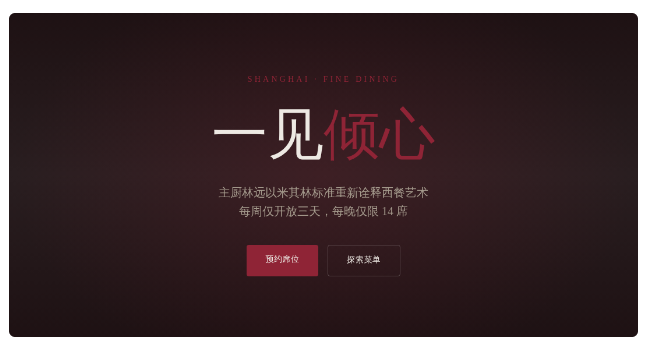
         <b>Maison Table</b>
      </a>
       社君
    </td>
    <td align="center" width="25%" valign="top">
      <a href="./prompts/ming-yun-tea.md">
        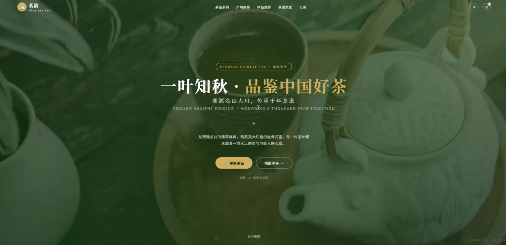
         <b>茗韵（Ming Yun Tea）</b>
      </a>
       English 糕手
    </td>
  </tr>
  <tr>
    <td align="center" width="25%" valign="top">
      <a href="./prompts/zhan-guan-yu-yue.md">
        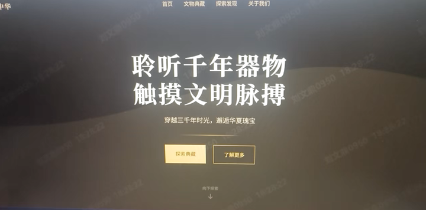
         <b>展馆预约</b>
      </a>
       厚重的中国文物
    </td>
    <td align="center" width="25%" valign="top">
      <a href="./prompts/bing-li-zhi-neng-shi-bie-xi-tong.md">
        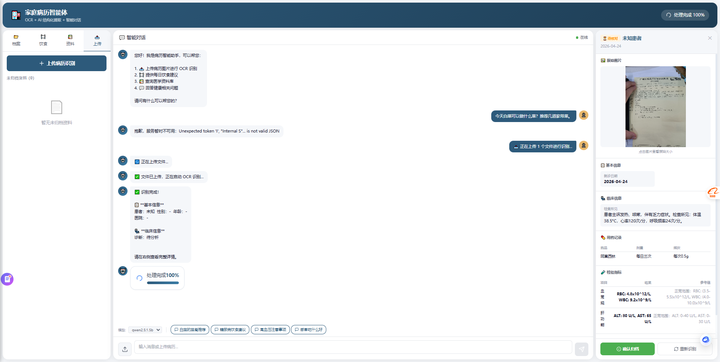
         <b>病历智能识别系统</b>
      </a>
       winna
    </td>
    <td align="center" width="25%" valign="top">
      <a href="./prompts/nexus-galaxy.md">
        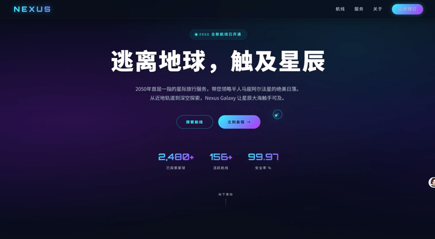
         <b>Nexus Galaxy</b>
      </a>
       努力只够及格，拼命才会赢
    </td>
    <td align="center" width="25%" valign="top">
      <a href="./prompts/zhu-jing-she-ji-quan-zhan-zuo-pin-ji-wang-zhan.md">
        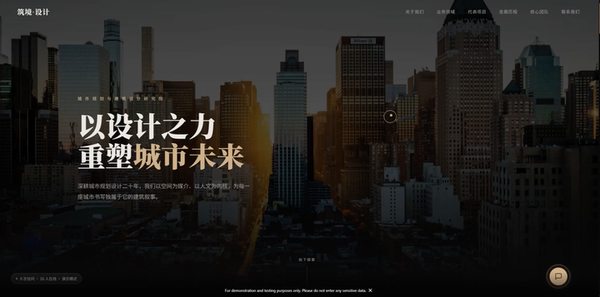
         <b>筑境设计全栈作品集网站</b>
      </a>
       姜子的认知课
    </td>
  </tr>
  <tr>
    <td align="center" width="25%" valign="top">
      <a href="./prompts/guang-ying-ji.md">
        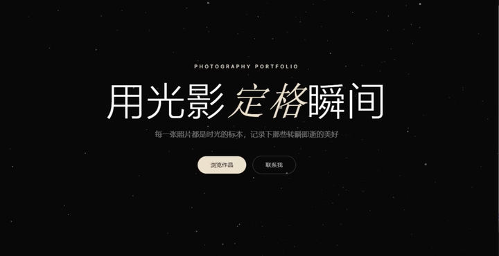
         <b>光影集</b>
      </a>
       郑在笑
    </td>
    <td align="center" width="25%" valign="top">
      <a href="./prompts/trailai.md">
        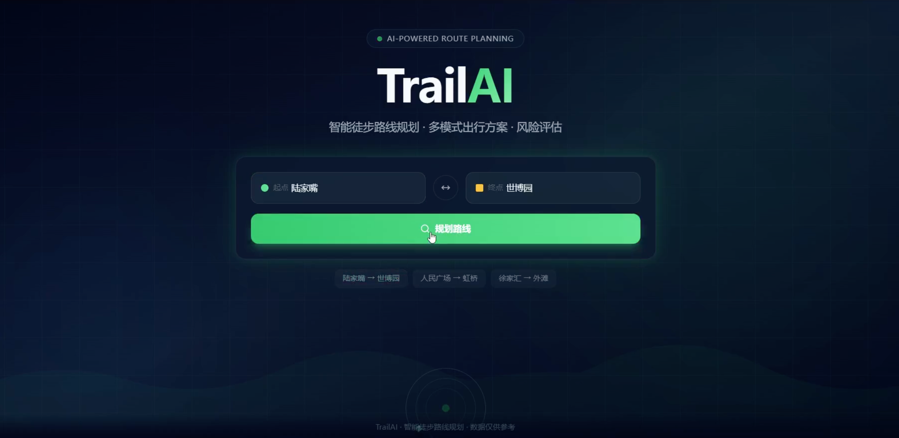
         <b>TrailAI</b>
      </a>
       小民
    </td>
    <td align="center" width="25%" valign="top">
      <a href="./prompts/robotbp.md">
        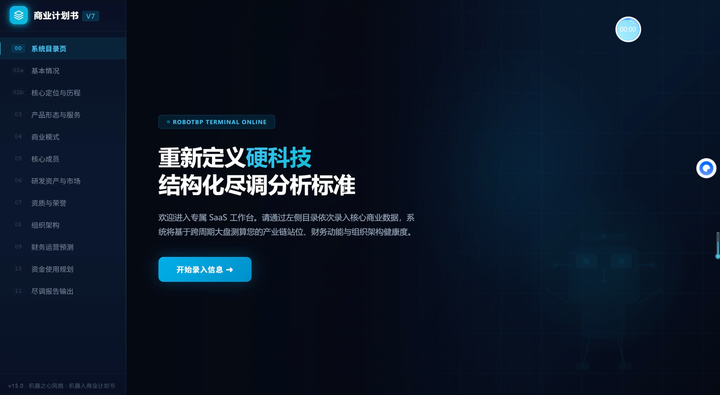
         <b>RobotBP</b>
      </a>
       迪慢慢
    </td>
    <td align="center" width="25%" valign="top">
      <a href="./prompts/lovedce.md">
        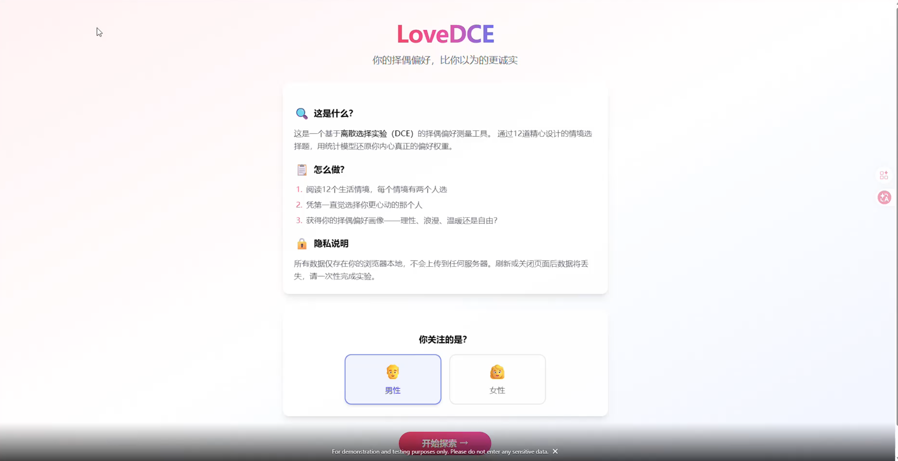
         <b>LoveDCE</b>
      </a>
       Nickel
    </td>
  </tr>
  <tr>
    <td align="center" width="25%" valign="top">
      <a href="./prompts/ge-ren-wang-ye.md">
        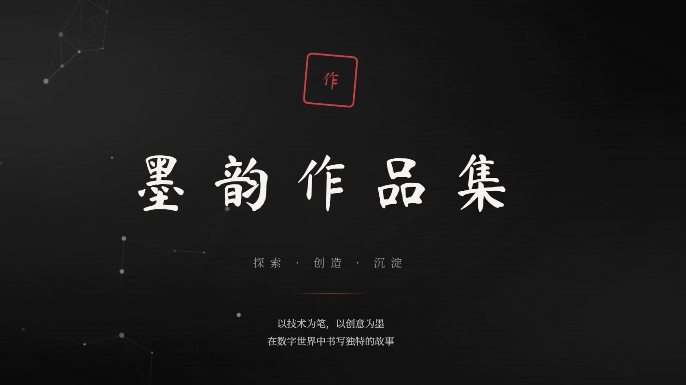
         <b>个人网页</b>
      </a>
       涛
    </td>
    <td align="center" width="25%" valign="top">
      <a href="./prompts/xuan-ku-ke-ji-feng-ge-ren-zhu-ye.md">
        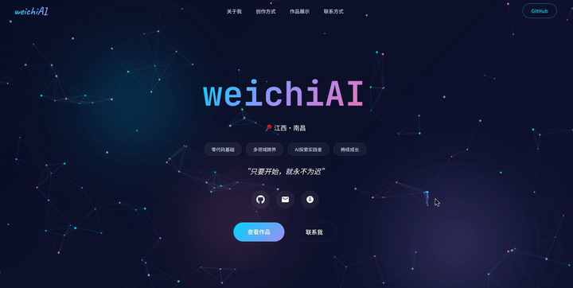
         <b>炫酷科技风个人主页</b>
      </a>
       未迟
    </td>
    <td align="center" width="25%" valign="top">
      <a href="./prompts/zhong-yuan-ji.md">
        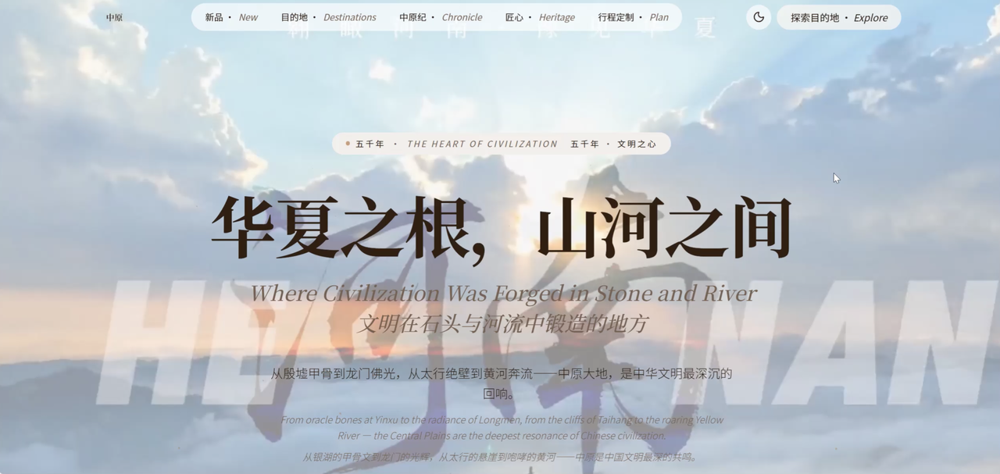
         <b>中原纪</b>
      </a>
       昏黎
    </td>
    <td align="center" width="25%" valign="top">
      <a href="./prompts/li-zi-yu-zhou.md">
        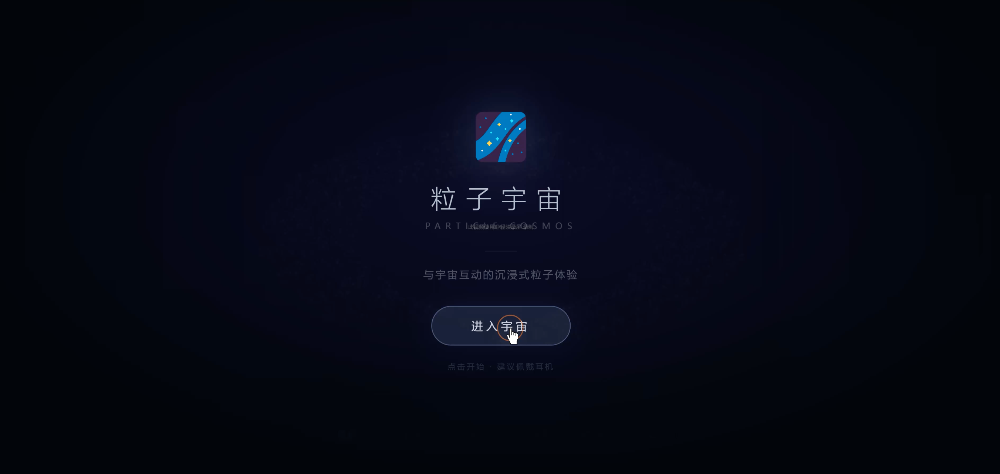
         <b>粒子宇宙</b>
      </a>
       陈萌
    </td>
  </tr>
  <tr>
    <td align="center" width="25%" valign="top">
      <a href="./prompts/launchkit-ai.md">
        
         <b>LaunchKit AI</b>
      </a>
       Field
    </td>
    <td align="center" width="25%" valign="top">
      <a href="./prompts/xin-tiao-shou-hu-zhe.md">
        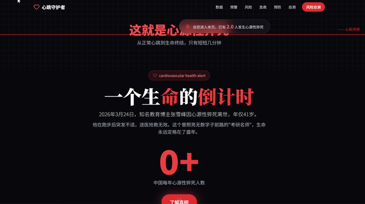
         <b>心跳守护者</b>
      </a>
       此木是才
    </td>
    <td align="center" width="25%" valign="top">
      <a href="./prompts/mars-token.md">
        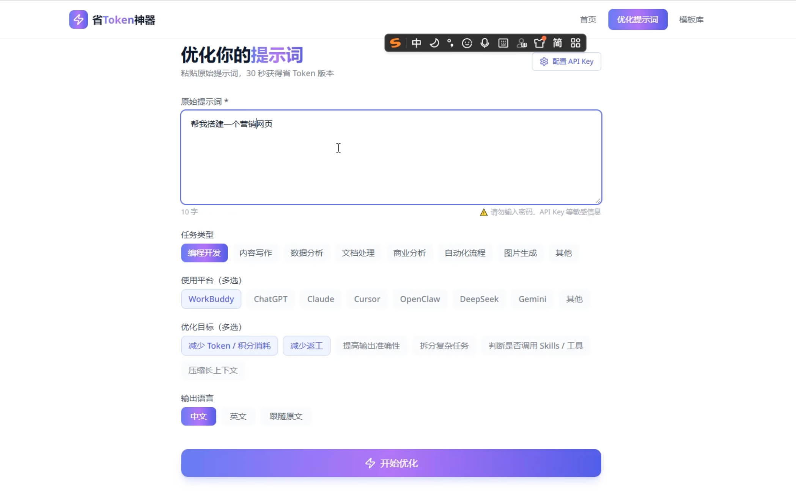
         <b>省Token神器</b>
      </a>
       maohua
    </td>
    <td align="center" width="25%" valign="top">
      <a href="./prompts/liu-da-wei-du-jian-kang-zheng-he-ping-gu-ke-shi-hu.md">
        
         <b>六大维度健康整合评估可视化报告</b>
      </a>
       HH101
    </td>
  </tr>
  <tr>
    <td align="center" width="25%" valign="top">
      <a href="./prompts/ding-she-pin-pai-zhan-shi-ye.md">
        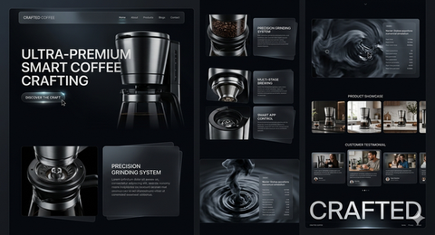
         <b>顶奢品牌展示页</b>
      </a>
       时间煮魚
    </td>
    <td align="center" width="25%" valign="top">
      <a href="./prompts/yi-kuan-tong-yong-hu-dong-ren-ge-ce-shi-wang-zhan-.md">
        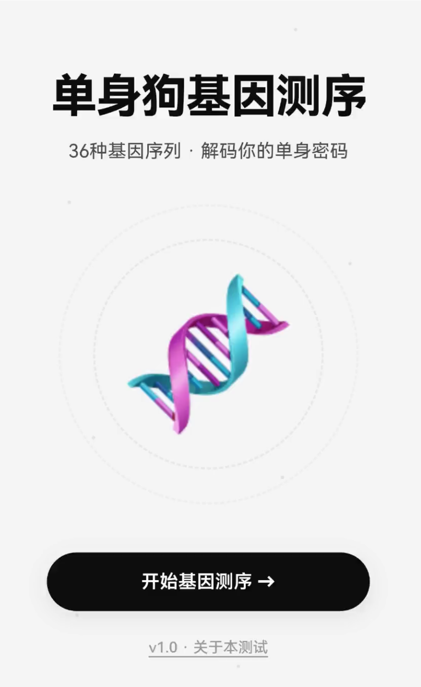
         <b>一款通用互动人格测试网站生成器</b>
      </a>
       橙元
    </td>
    <td align="center" width="25%" valign="top">
      <a href="./prompts/kuai-di-xiao-ge-jie-dan-xiao-cheng-xu.md">
        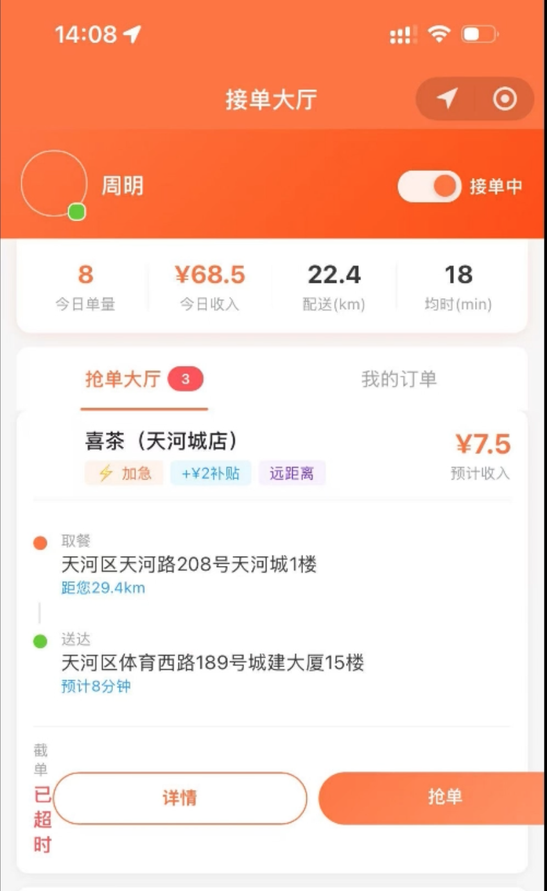
         <b>快递小哥接单小程序</b>
      </a>
       周明
    </td>
    <td align="center" width="25%" valign="top">
      <a href="./prompts/sop-engine.md">
        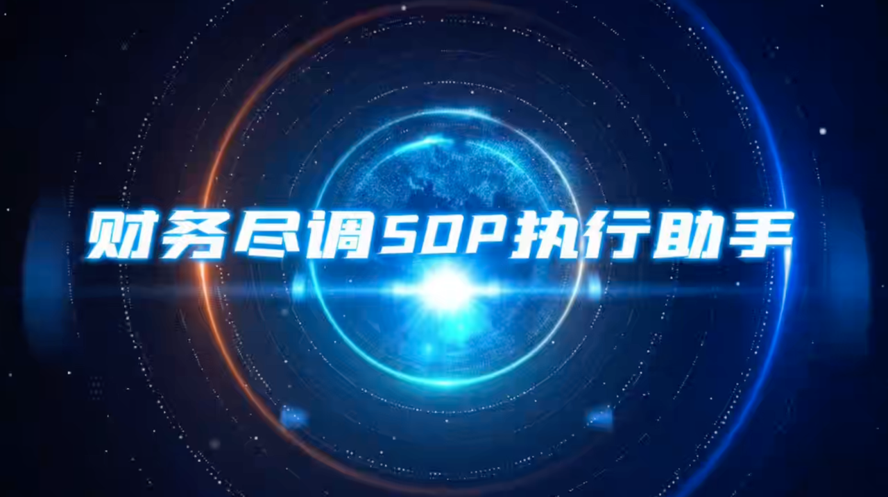
         <b>财务尽调SOP执行助手</b>
      </a>
       April
    </td>
  </tr>
  <tr>
    <td align="center" width="25%" valign="top">
      <a href="./prompts/luxe-motor.md">
        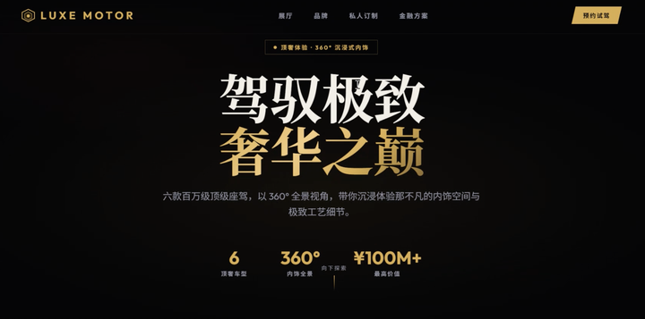
         <b>LUXE MOTOR</b>
      </a>
       轻池
    </td>
    <td align="center" width="25%" valign="top">
      <a href="./prompts/ru-guo-hu-lian-wang-xiao-shi-ni-hai-sheng-xia-shui.md">
        
         <b>如果互联网消失，你还剩下谁</b>
      </a>
       反
    </td>
    <td align="center" width="25%" valign="top">
      <a href="./prompts/bao-ke-meng-ka-pai-chou-ka-mo-ni-qi.md">
        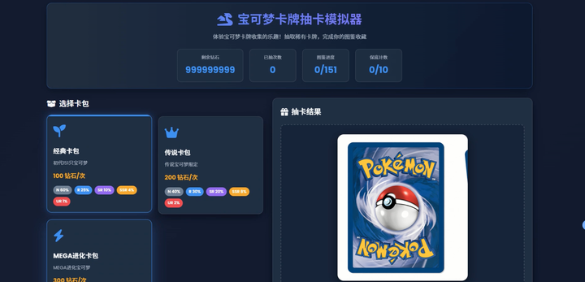
         <b>宝可梦卡牌抽卡模拟器</b>
      </a>
       胡岚
    </td>
    <td align="center" width="25%" valign="top">
      <a href="./prompts/ren-qing-wen-du-ji.md">
        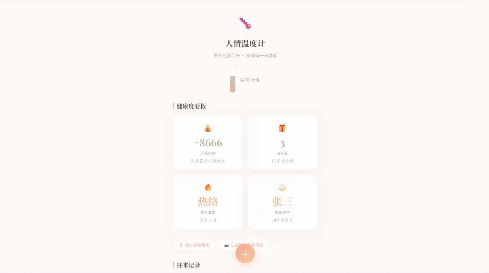
         <b>人情温度计</b>
      </a>
       Knox
    </td>
  </tr>
  <tr>
    <td align="center" width="25%" valign="top">
      <a href="./prompts/gao-ding-nv-zhuang-guan-wang.md">
        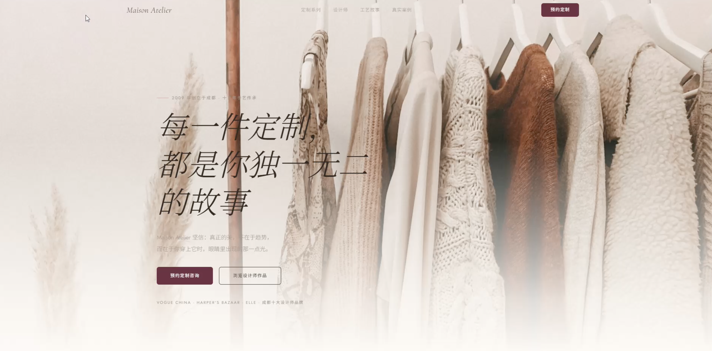
         <b>高定女装官网</b>
      </a>
       吴昊
    </td>
    <td align="center" width="25%" valign="top">
      <a href="./prompts/zhi-hui-ban-ji-chou-jiang-xi-tong.md">
        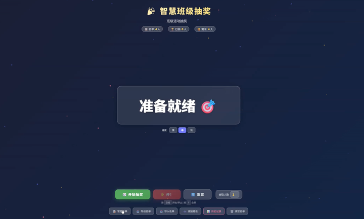
         <b>智慧班级抽奖系统</b>
      </a>
       cici
    </td>
    <td align="center" width="25%" valign="top">
      <a href="./prompts/hang-zhou-di-chan-zhi-tu.md">
        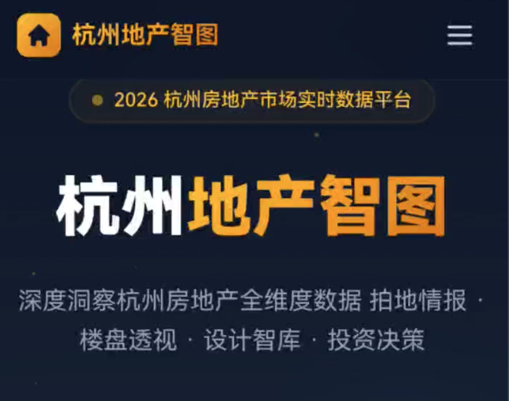
         <b>杭州地产智图</b>
      </a>
       限定设计
    </td>
    <td align="center" width="25%" valign="top">
      <a href="./prompts/jian-kang-ke-pu-wang-zhan.md">
        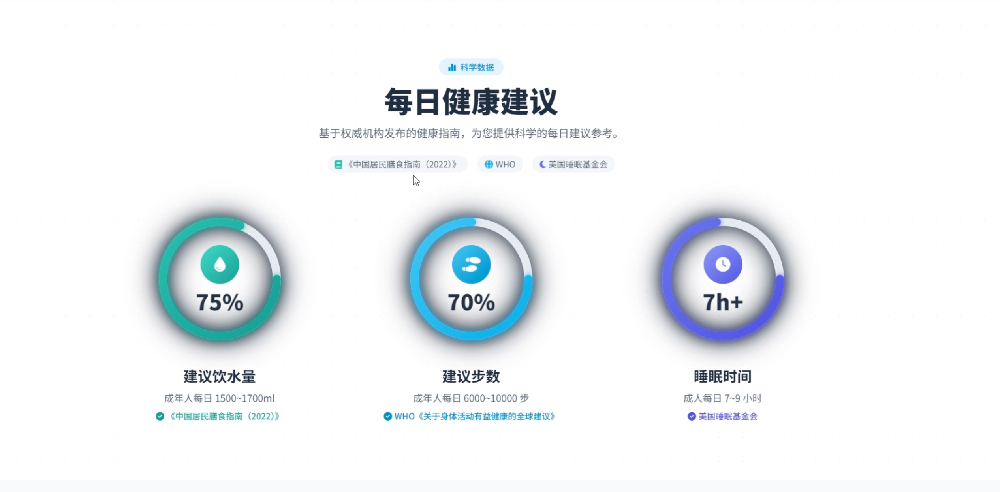
         <b>健康科普网站</b>
      </a>
       TK
    </td>
  </tr>
  <tr>
    <td align="center" width="25%" valign="top">
      <a href="./prompts/ji-jian-ge-ren-bo-ke.md">
        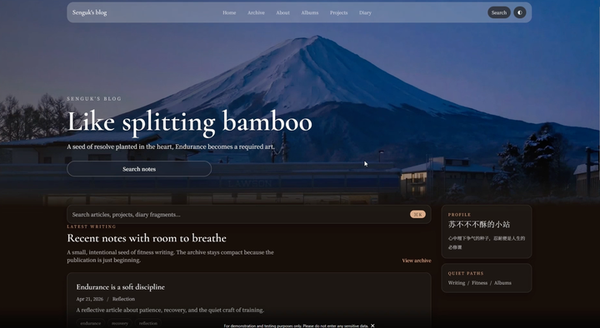
         <b>极简个人博客</b>
      </a>
       苏不不不酥
    </td>
    <td align="center" width="25%" valign="top">
      <a href="./prompts/shu-zi-you-zi.md">
        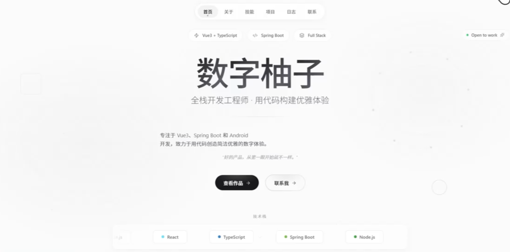
         <b>数字柚子</b>
      </a>
       小柚子
    </td>
    <td align="center" width="25%" valign="top">
      <a href="./prompts/academic-hub.md">
        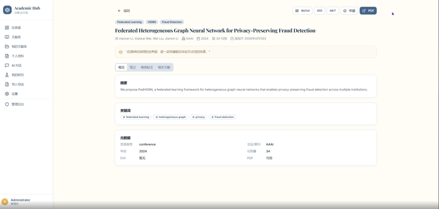
         <b>Academic Hub</b>
      </a>
       榆鸑
    </td>
    <td align="center" width="25%" valign="top">
      <a href="./prompts/ge-ren-zuo-pin-ji-wang-zhan.md">
        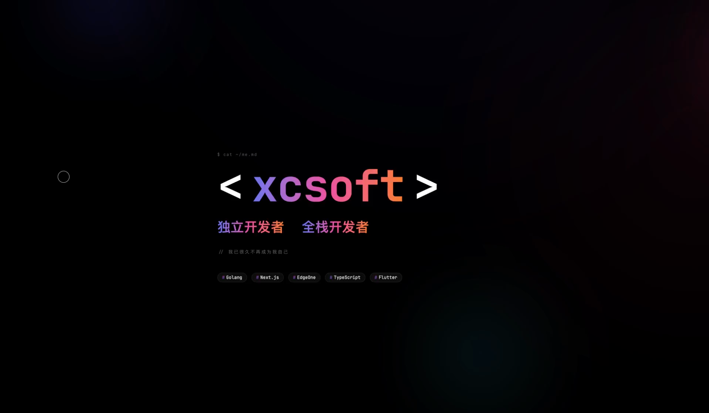
         <b>个人作品集网站</b>
      </a>
       xcsoft
    </td>
  </tr>
  <tr>
    <td align="center" width="25%" valign="top">
      <a href="./prompts/ge-di-wen-lv-zu-qiu-sai-de-wang-ye.md">
        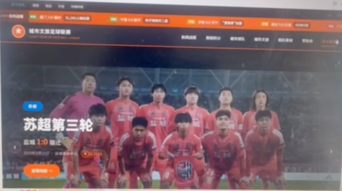
         <b>各地文旅足球赛的网页</b>
      </a>
       Leon
    </td>
    <td align="center" width="25%" valign="top">
      <a href="./prompts/breakout-legend.md">
        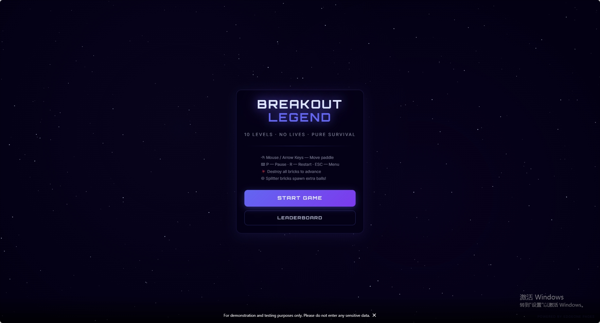
         <b>Breakout Legend — 打砖块小游戏</b>
      </a>
       qjh
    </td>
    <td align="center" width="25%" valign="top">
      <a href="./prompts/global-vehicle-mall.md">
        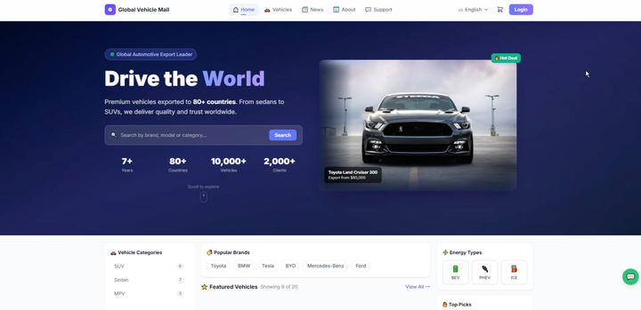
         <b>Global Vehicle Mall</b>
      </a>
       不吃小鱼干
    </td>
    <td align="center" width="25%" valign="top">
      <a href="./prompts/you-sheng-you-yu-wang-zhan.md">
        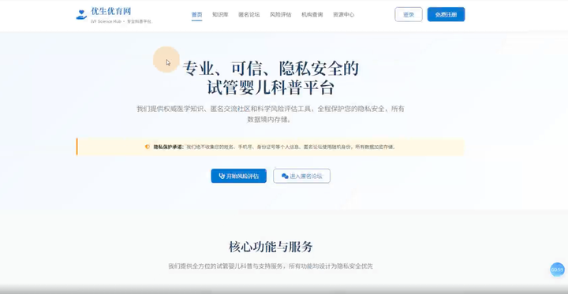
         <b>优生优育网站</b>
      </a>
       道请居士
    </td>
  </tr>
  <tr>
    <td align="center" width="25%" valign="top">
      <a href="./prompts/cloud-haven.md">
        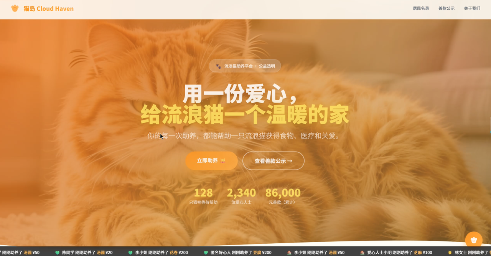
         <b>猫岛 Cloud Haven</b>
      </a>
       老腊肉大师兄
    </td>
    <td align="center" width="25%" valign="top">
      <a href="./prompts/eve-tan-edge-of-architecture.md">
        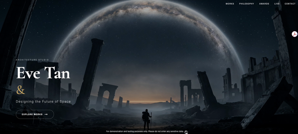
         <b>Eve Tan: Edge of Architecture</b>
      </a>
       谭彦文
    </td>
    <td align="center" width="25%" valign="top">
      <a href="./prompts/tu-shu-guan-li-xi-tong.md">
        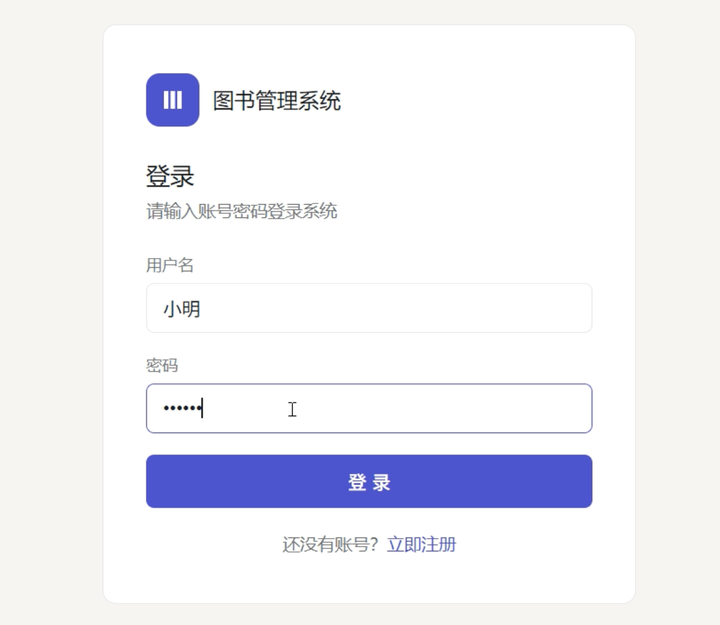
         <b>图书管理系统</b>
      </a>
       六月的雨在Tencent
    </td>
    <td align="center" width="25%" valign="top">
      <a href="./prompts/qiu-lin.md">
        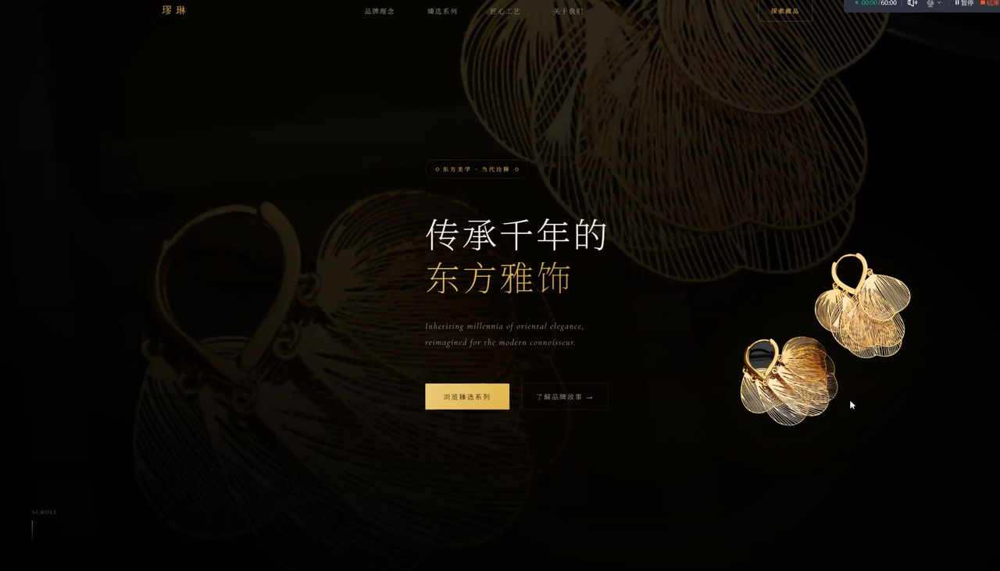
         <b>璆琳</b>
      </a>
       张艳
    </td>
  </tr>
  <tr>
    <td align="center" width="25%" valign="top">
      <a href="./prompts/lv-ji-shi-jing-lv-you-zhi-nan.md">
        
         <b>旅迹 · 实景旅游指南</b>
      </a>
       卢廷皓
    </td>
    <td align="center" width="25%" valign="top">
      <a href="./prompts/xiao-shi-de-hang-dang.md">
        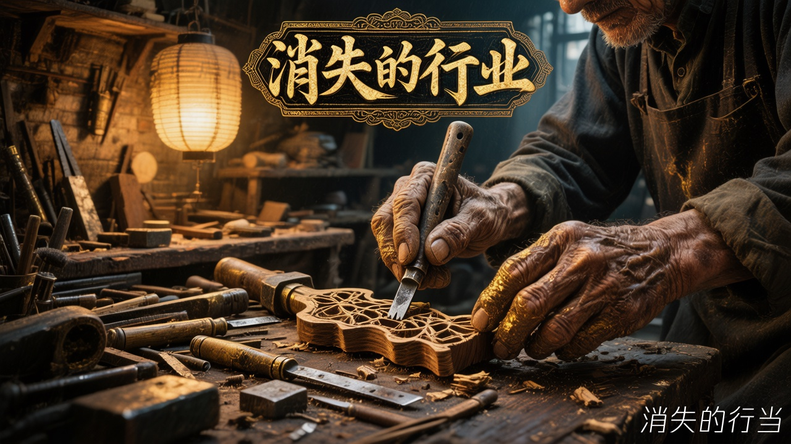
         <b>消失的行当</b>
      </a>
       贺玉涵
    </td>
    <td align="center" width="25%" valign="top">
      <a href="./prompts/ai-bao-mu.md">
        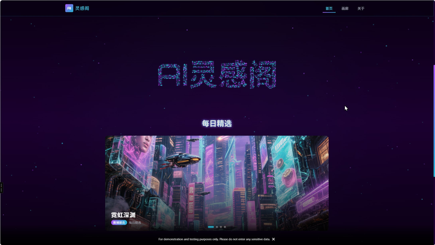
         <b>AI灵感阁</b>
      </a>
       ACoding
    </td>
    <td align="center" width="25%" valign="top">
      <a href="./prompts/ai-75.md">
        
         <b>沉浸式AI艺术画廊网站</b>
      </a>
       朴
    </td>
  </tr>
  <tr>
    <td align="center" width="25%" valign="top">
      <a href="./prompts/ppt-generator.md">
        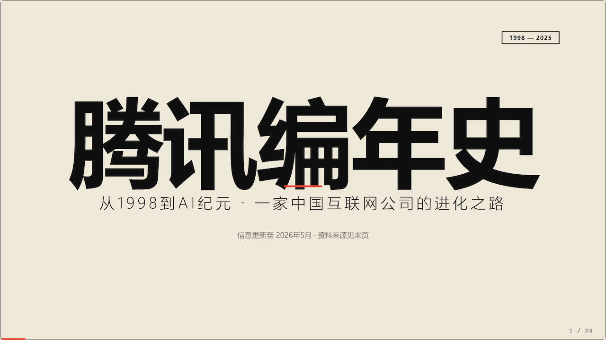
         <b>网页 PPT 生成方案</b>
      </a>
       s1eke
    </td>
    <td align="center" width="25%" valign="top">
      <a href="./prompts/yi-fu-shou-mai-tao-bao-mai-jia-wang-ye.md">
        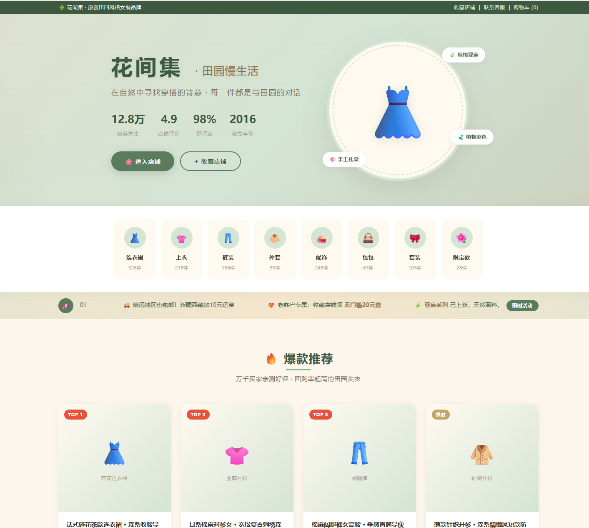
         <b>衣服售卖淘宝卖家网页</b>
      </a>
       Alex
    </td>
    <td align="center" width="25%" valign="top">
      <a href="./prompts/museum.md">
        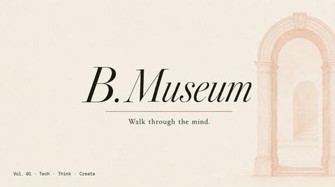
         <b>Museum · 个人作品博物馆</b>
      </a>
       黄梓庭
    </td>
    <td align="center" width="25%" valign="top">
      <a href="./prompts/luo-di-ye-zhuan-hua-lv-yi-sheng.md">
        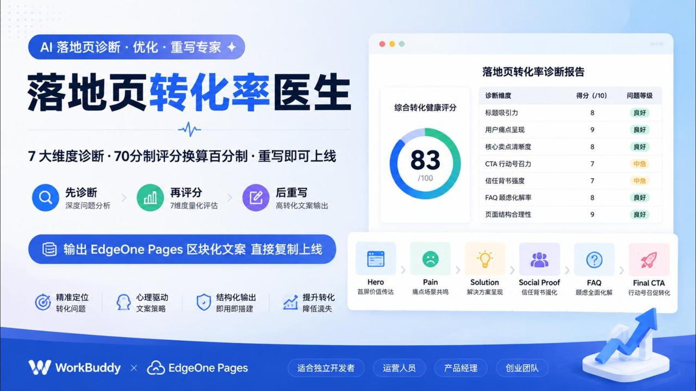
         <b>落地页转化率医生</b>
      </a>
       谭昊
    </td>
  </tr>
  <tr>
    <td align="center" width="25%" valign="top">
      <a href="./prompts/li-zi-liu-ti-jiao-xiang-qu.md">
        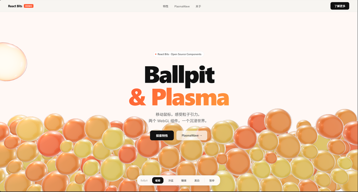
         <b>粒子流体交响曲</b>
      </a>
       于鸿伟
    </td>
    <td align="center" width="25%" valign="top">
      <a href="./prompts/jiao-an-she-ji-zhi-neng-zhu-shou.md">
        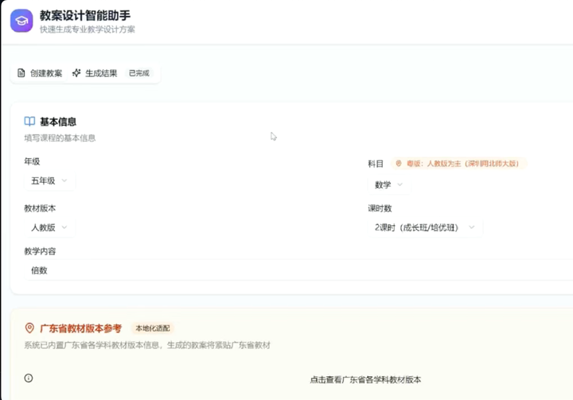
         <b>教案设计智能助手</b>
      </a>
       Manci-Lu
    </td>
    <td align="center" width="25%" valign="top">
      <a href="./prompts/sui-ji-chi.md">
        
         <b>随机吃</b>
      </a>
       刘瑜
    </td>
    <td align="center" width="25%" valign="top">
      <a href="./prompts/flowmate.md">
        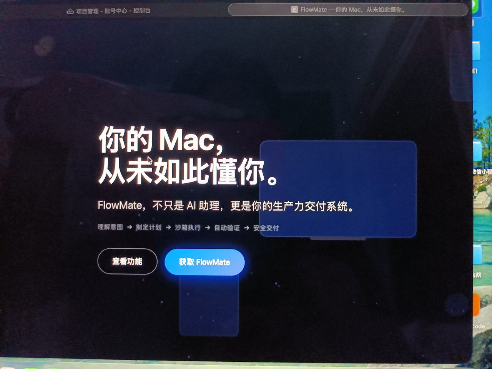
         <b>FlowMate</b>
      </a>
       陈晓捷（牛顿）
    </td>
  </tr>
  <tr>
    <td align="center" width="25%" valign="top">
      <a href="./prompts/marginalia.md">
        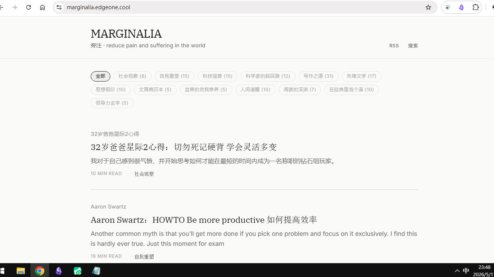
         <b>MARGINALIA（旁注）</b>
      </a>
       ntptc
    </td>
    <td align="center" width="25%" valign="top">
      <a href="./prompts/wu-fan-yao-hao-xi-tong.md">
        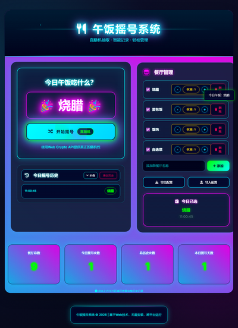
         <b>午饭摇号系统</b>
      </a>
       Adularia
    </td>
    <td align="center" width="25%" valign="top">
      <a href="./prompts/shan-hai-jing-yi-shou-dang-an-guan.md">
        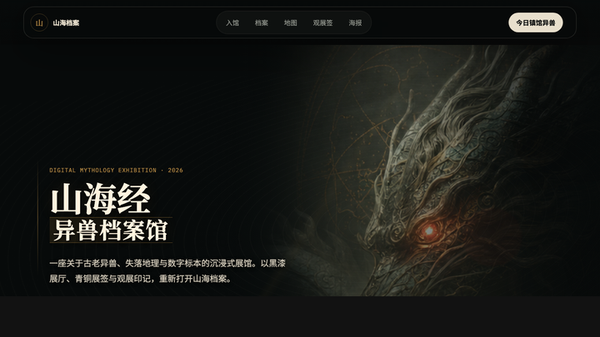
         <b>山海经异兽档案馆</b>
      </a>
       深夜程序员
    </td>
    <td align="center" width="25%" valign="top">
      <a href="./prompts/brochure-mobile.md">
        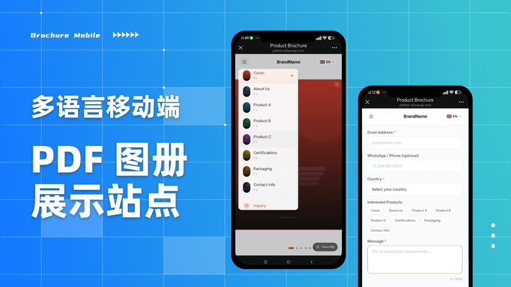
         <b>Brochure Mobile</b>
      </a>
       郑坚兵
    </td>
  </tr>
  <tr>
    <td align="center" width="25%" valign="top">
      <a href="./prompts/ai-paint-share.md">
        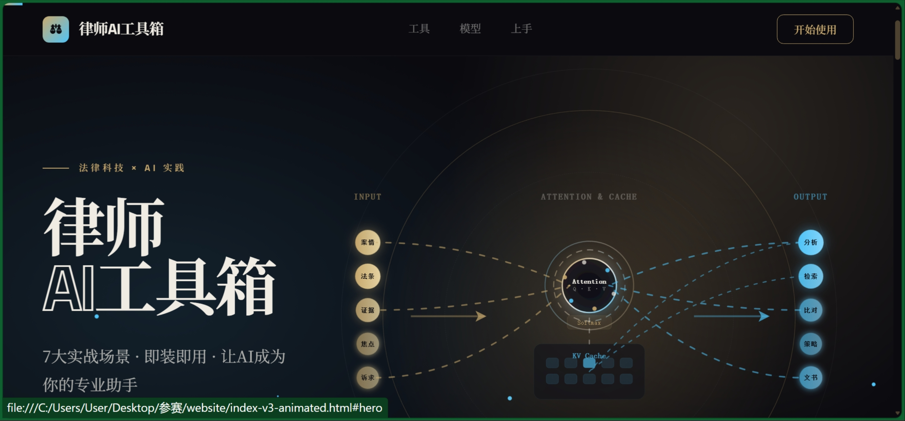
         <b>律师AI工具箱</b>
      </a>
       qingyun
    </td>
    <td align="center" width="25%" valign="top">
      <a href="./prompts/hermes-agent.md">
        
         <b>Hermes Agent智能代理</b>
      </a>
       CaVaN_9
    </td>
    <td align="center" width="25%" valign="top">
      <a href="./prompts/bean-journey.md">
        
         <b>BEAN JOURNEY</b>
      </a>
       曾卉
    </td>
    <td align="center" width="25%" valign="top">
      <a href="./prompts/soul-trace.md">
        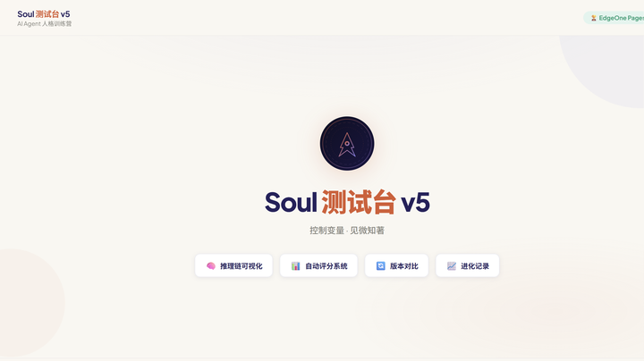
         <b>Soul 测试台</b>
      </a>
       Senkawa
    </td>
  </tr>
  <tr>
    <td align="center" width="25%" valign="top">
      <a href="./prompts/diary-world.md">
        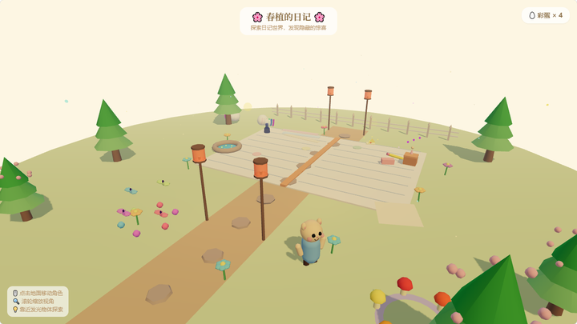
         <b>一山的日记 · Diary World</b>
      </a>
       见山又一山
    </td>
    <td align="center" width="25%" valign="top">
      <a href="./prompts/yun-he-fu-shou-ju-kang-yang-zhong-xin.md">
        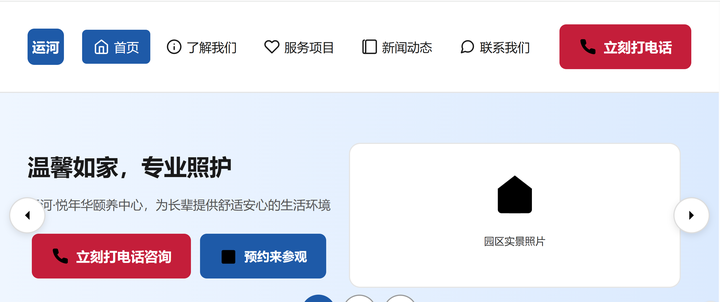
         <b>运河·福寿居康养中心</b>
      </a>
       高宽
    </td>
    <td align="center" width="25%" valign="top">
      <a href="./prompts/ai-avatar-pro.md">
        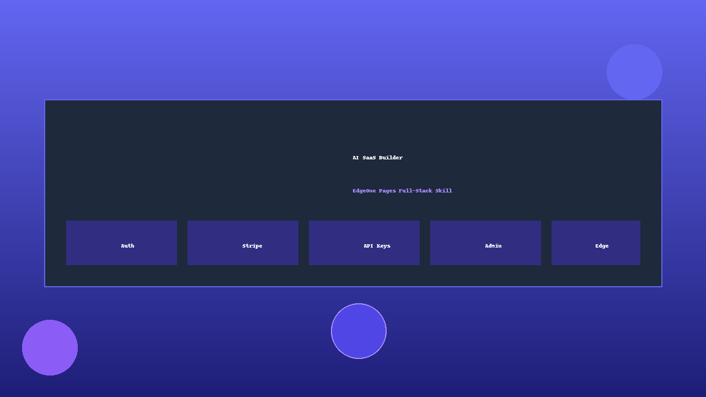
         <b>AI Avatar Pro</b>
      </a>
       庞通
    </td>
    <td align="center" width="25%" valign="top">
      <a href="./prompts/er-ci-yuan-feng-ge-ge-ren-bo-ke.md">
        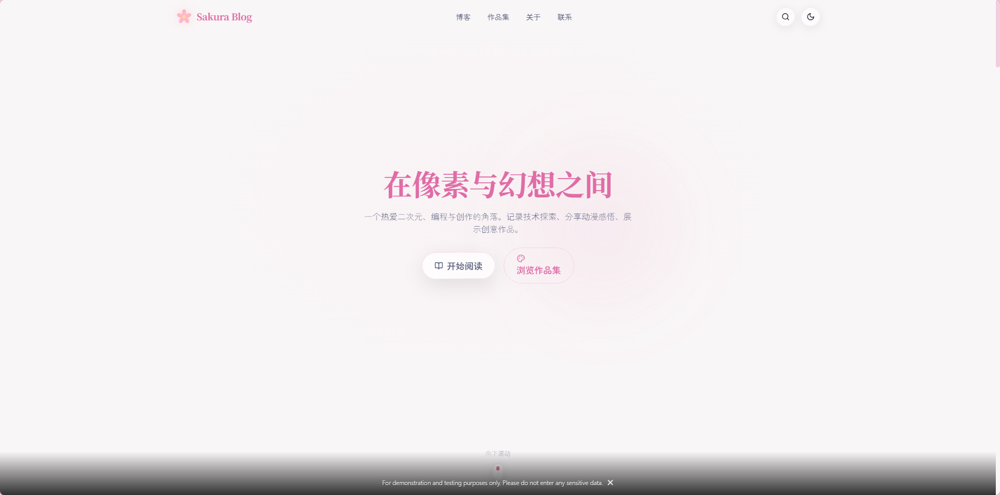
         <b>二次元风格个人博客</b>
      </a>
       蒲浩
    </td>
  </tr>
  <tr>
    <td align="center" width="25%" valign="top">
      <a href="./prompts/one-person-company-mission-control.md">
        
         <b>One-Person Company Mission Control</b>
      </a>
       Savio
    </td>
    <td align="center" width="25%" valign="top">
      <a href="./prompts/inkling.md">
        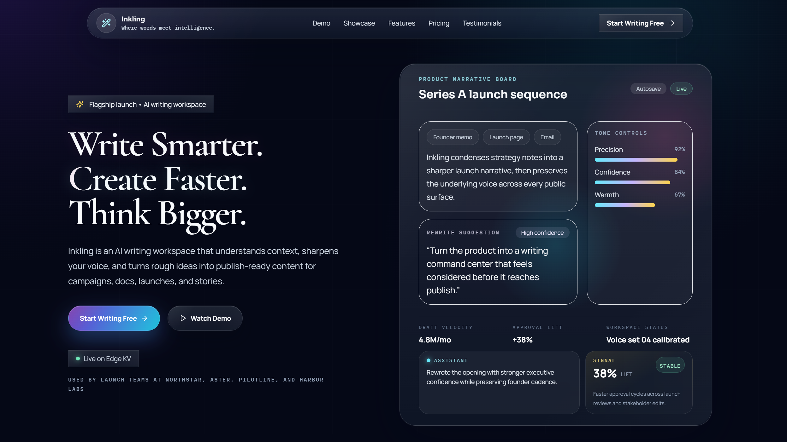
         <b>Inkling</b>
      </a>
       RunnerQuan
    </td>
    <td align="center" width="25%" valign="top">
      <a href="./prompts/zhi-yu-da-ti-xiao-cheng-xu.md">
        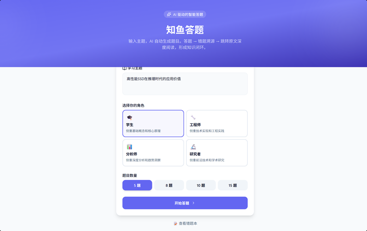
         <b>知鱼答题小程序</b>
      </a>
       trylab
    </td>
    <td align="center" width="25%" valign="top">
      <a href="./prompts/echo-app.md">
        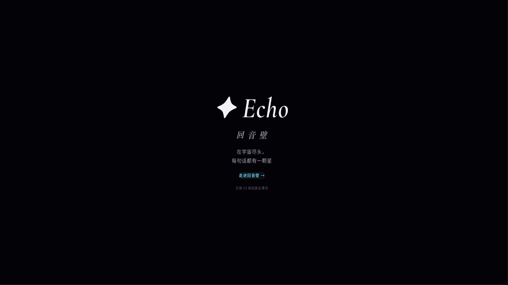
         <b>Echo</b>
      </a>
       FKL
    </td>
  </tr>
  <tr>
    <td align="center" width="25%" valign="top">
      <a href="./prompts/node-blog.md">
        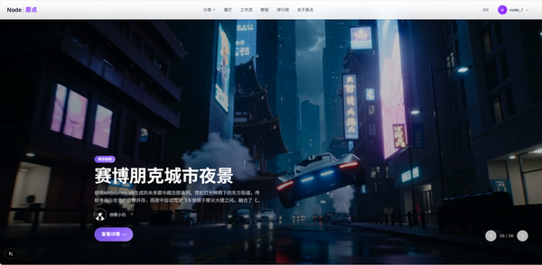
         <b>Node \| 原点</b>
      </a>
       木白_BYMU
    </td>
    <td align="center" width="25%" valign="top">
      <a href="./prompts/one-person-company-mission-control-114.md">
        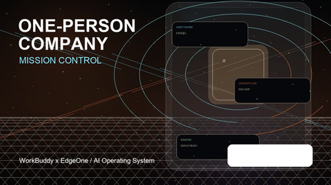
         <b>One-Person Company Mission Control</b>
      </a>
       Savio
    </td>
    <td align="center" width="25%" valign="top">
      <a href="./prompts/guang-zhou-shi-zeng-cheng-qing-yi-zhen-kong-beng-j.md">
        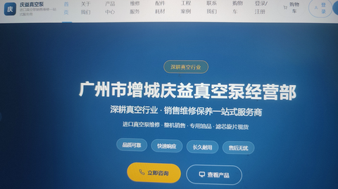
         <b>广州市增城庆益真空泵经营部官网首页</b>
      </a>
       益智
    </td>
    <td align="center" width="25%" valign="top">
      <a href="./prompts/zhuan-shu-jia-shi-cang.md">
        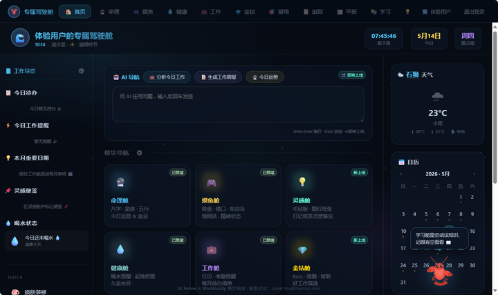
         <b>专属驾驶舱</b>
      </a>
       Renee
    </td>
  </tr>
  <tr>
    <td align="center" width="25%" valign="top">
      <a href="./prompts/dreamybot-studio.md">
        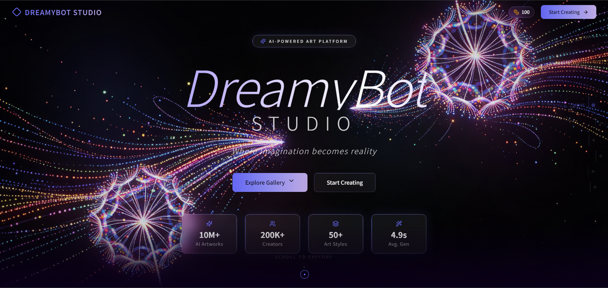
         <b>DreamyBot Studio</b>
      </a>
       dreamybot
    </td>
    <td align="center" width="25%" valign="top">
      <a href="./prompts/zhi-neng-zhao-pin-yi-biao-pan.md">
        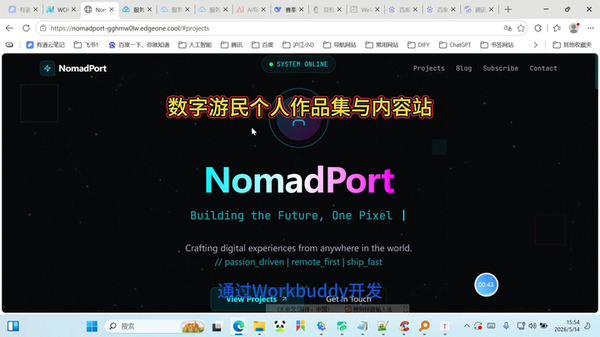
         <b>智能招聘仪表盘</b>
      </a>
       严学峰
    </td>
    <td align="center" width="25%" valign="top">
      <a href="./prompts/nomadport.md">
        
         <b>NomadPort —— 数字游民作品集</b>
      </a>
       严学峰
    </td>
    <td align="center" width="25%" valign="top">
      <a href="./prompts/landscapeflow-ai.md">
        
         <b>LandscapeFlow AI</b>
      </a>
       李博
    </td>
  </tr>
  <tr>
    <td align="center" width="25%" valign="top">
      <a href="./prompts/nexuschat.md">
        
         <b>NexusChat</b>
      </a>
       蜗牛
    </td>
    <td align="center" width="25%" valign="top">
      <a href="./prompts/petvibe.md">
        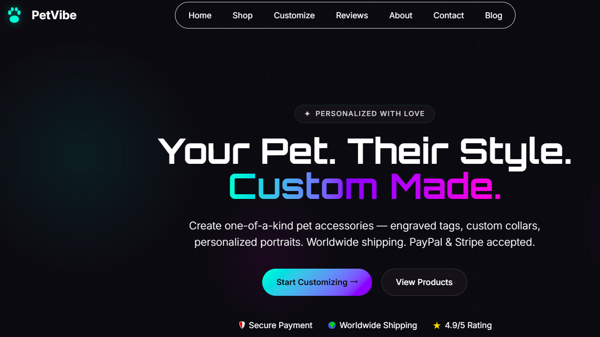
         <b>PetVibe</b>
      </a>
       bobo
    </td>
    <td align="center" width="25%" valign="top">
      <a href="./prompts/ai-127.md">
        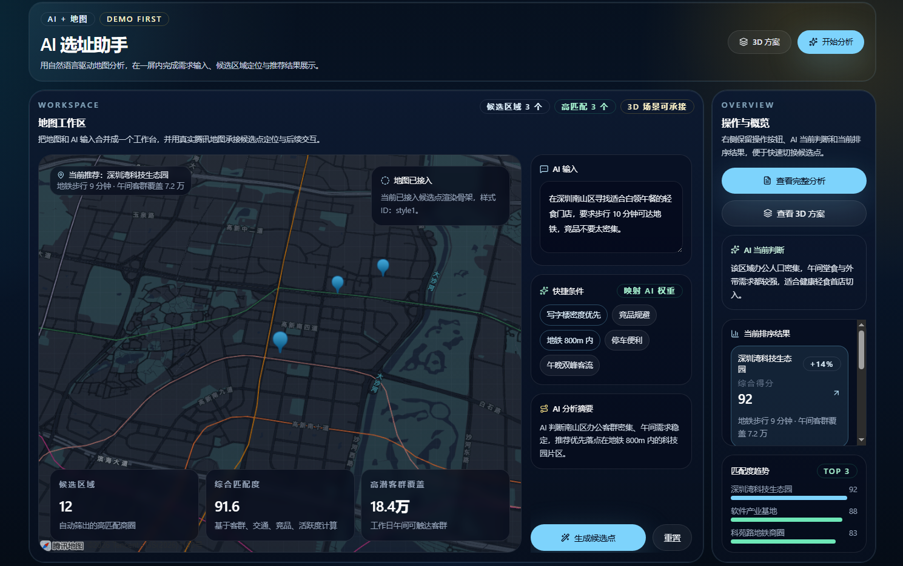
         <b>AI 选址助手</b>
      </a>
       木斯佳
    </td>
    <td align="center" width="25%" valign="top">
      <a href="./prompts/ge-ren-zuo-pin-ji.md">
        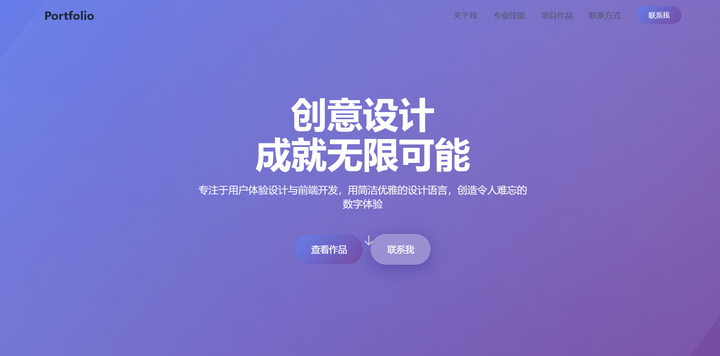
         <b>个人作品集</b>
      </a>
       贺国雄
    </td>
  </tr>
  <tr>
    <td align="center" width="25%" valign="top">
      <a href="./prompts/lucid-01.md">
        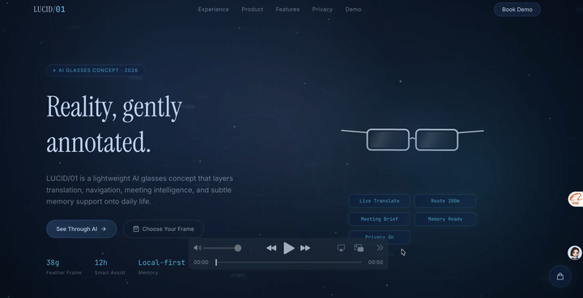
         <b>LUCID/01</b>
      </a>
       张miao
    </td>
    <td align="center" width="25%" valign="top">
      <a href="./prompts/yun-lai-zhang-gui-qi-ye-guan-wang.md">
        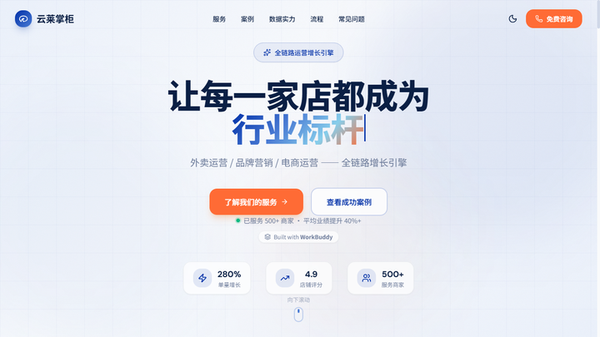
         <b>云莱掌柜企业官网</b>
      </a>
       陈龙
    </td>
    <td align="center" width="25%" valign="top">
      <a href="./prompts/opsvision.md">
        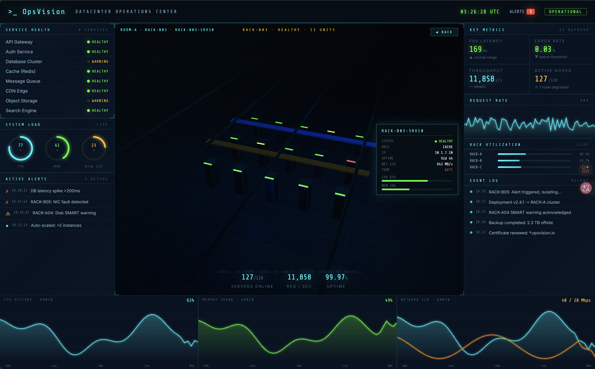
         <b>OpsVision</b>
      </a>
       wuyafeiya
    </td>
    <td align="center" width="25%" valign="top">
      <a href="./prompts/ke-ji-tan-xian-jia.md">
        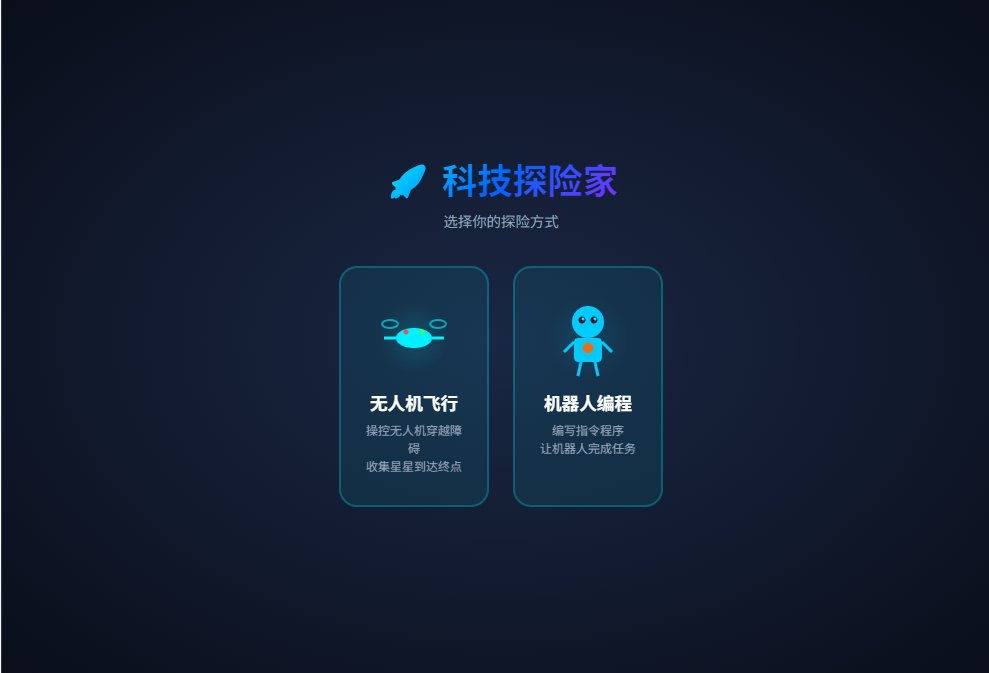
         <b>科技探险家</b>
      </a>
       洋
    </td>
  </tr>
  <tr>
    <td align="center" width="25%" valign="top">
      <a href="./prompts/netkeeper.md">
        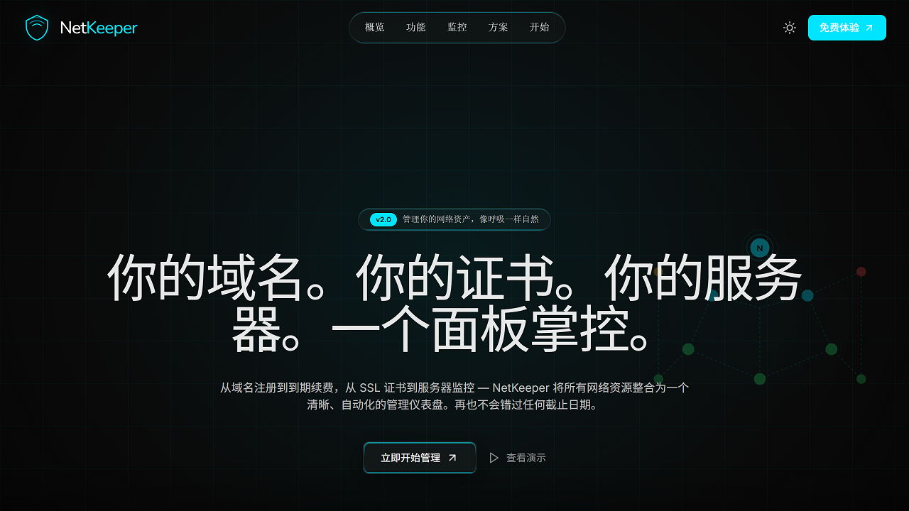
         <b>NetKeeper</b>
      </a>
       幽静森林
    </td>
    <td align="center" width="25%" valign="top">
      <a href="./prompts/li-shang-yuan.md">
        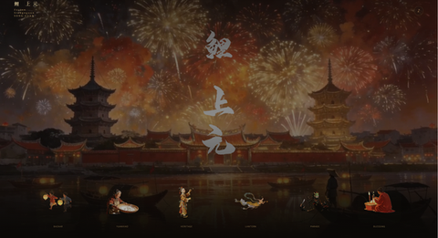
         <b>鲤上元</b>
      </a>
       杨舒恒
    </td>
    <td align="center" width="25%" valign="top">
      <a href="./prompts/landscapeflow-ai-145.md">
        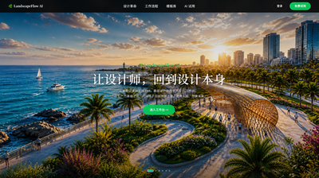
         <b>LandscapeFlow AI</b>
      </a>
       李博
    </td>
    <td align="center" width="25%" valign="top">
      <a href="./prompts/chipagent-pro.md">
        
         <b>ChipAgent Pro</b>
      </a>
       殷巍
    </td>
  </tr>
  <tr>
    <td align="center" width="25%" valign="top">
      <a href="./prompts/hua-yu-shi-jie.md">
        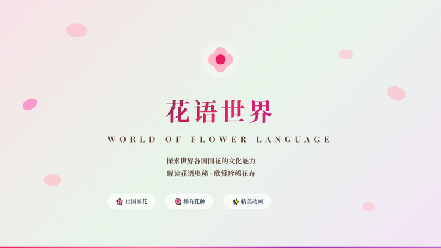
         <b>花语世界</b>
      </a>
       sia不是cia
    </td>
    <td align="center" width="25%" valign="top">
      <a href="./prompts/lifeclock.md">
        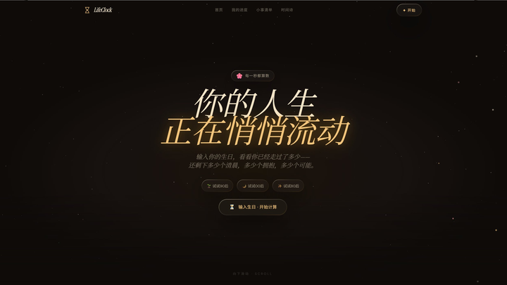
         <b>LifeClock</b>
      </a>
       陈海健
    </td>
    <td align="center" width="25%" valign="top">
      <a href="./prompts/qi-miao-she-ji-guan-wang.md">
        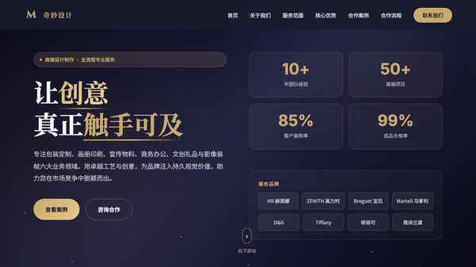
         <b>奇妙设计官网</b>
      </a>
       邹钰明
    </td>
    <td align="center" width="25%" valign="top">
      <a href="./prompts/jue-ce-sha-pan-154.md">
        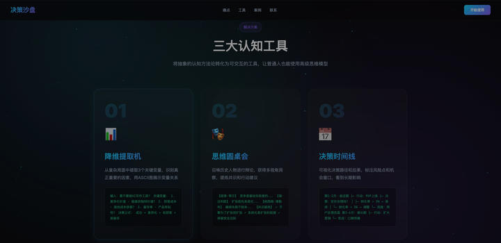
         <b>决策沙盘</b>
      </a>
       硅蜜
    </td>
  </tr>
  <tr>
    <td align="center" width="25%" valign="top">
      <a href="./prompts/cloudscroll.md">
        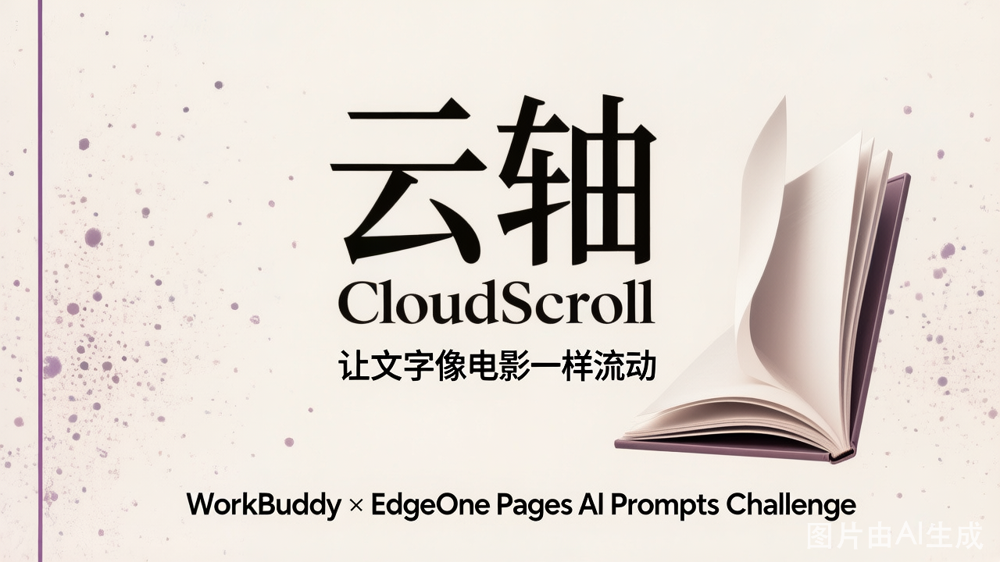
         <b>云轴 CloudScroll</b>
      </a>
       kevin
    </td>
    <td align="center" width="25%" valign="top">
      <a href="./prompts/nexus-ai.md">
        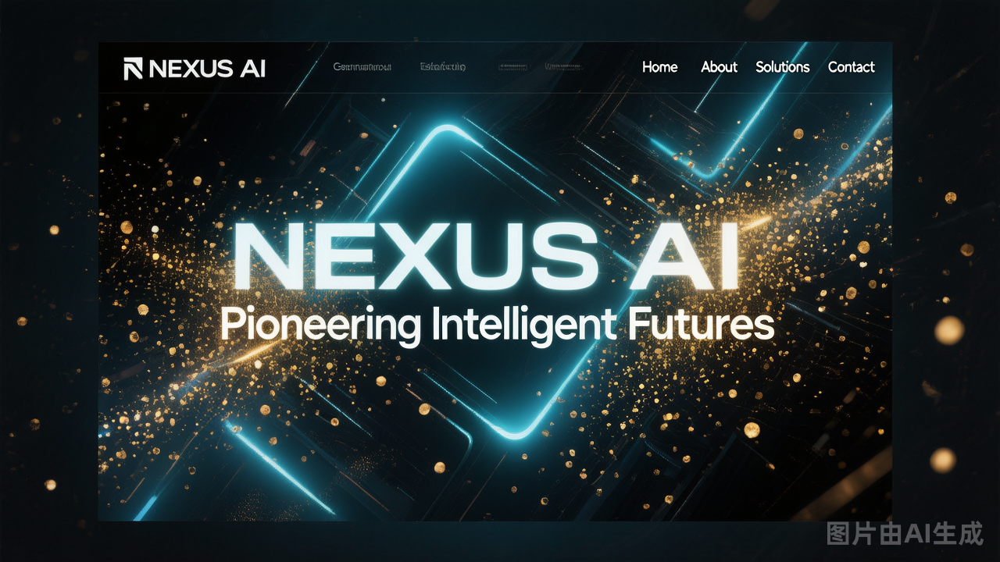
         <b>NEXUS AI</b>
      </a>
       青衣鸿
    </td>
    <td align="center" width="25%" valign="top">
      <a href="./prompts/aitoursage-pro.md">
        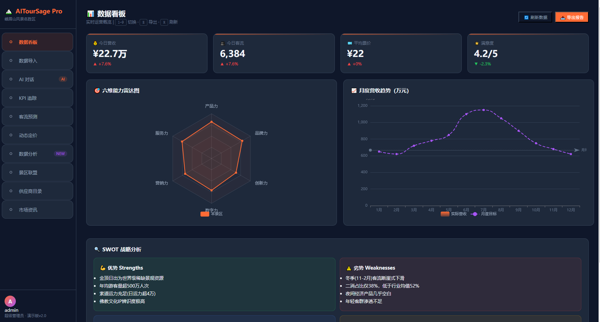
         <b>AITourSage Pro</b>
      </a>
       90后的00鉌枝铢
    </td>
    <td align="center" width="25%" valign="top">
      <a href="./prompts/ren-wu-qian-qiu.md">
        
         <b>人物千秋</b>
      </a>
       振一
    </td>
  </tr>
  <tr>
    <td align="center" width="25%" valign="top">
      <a href="./prompts/zhong-guo-you-zheng-gao-kao-zhu-ti.md">
        
         <b>中国邮政 × 高考主题</b>
      </a>
       好雨知时节
    </td>
    <td align="center" width="25%" valign="top">
      <a href="./prompts/xue-xi-yu-mao-qiu-hui-pai-dong-zuo.md">
        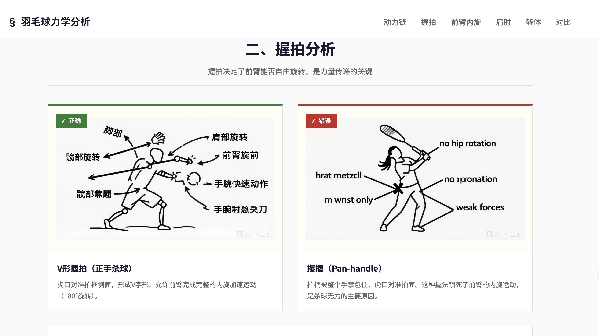
         <b>学习羽毛球挥拍动作</b>
      </a>
       郎咸蒙
    </td>
    <td align="center" width="25%" valign="top">
      <a href="./prompts/sheng-cheng-shen-mei-zai-xian-de-chuang-yi-wang-ye.md">
        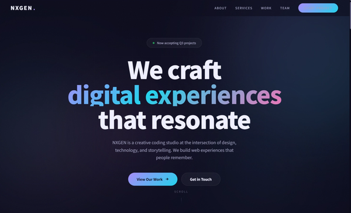
         <b>生成审美在线的创意网页</b>
      </a>
       nekomm
    </td>
    <td align="center" width="25%" valign="top">
      <a href="./prompts/daily-buzz.md">
        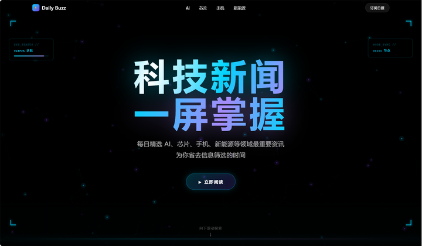
         <b>Daily Buzz</b>
      </a>
       寒木
    </td>
  </tr>
  <tr>
    <td align="center" width="25%" valign="top">
      <a href="./prompts/clat-saas.md">
        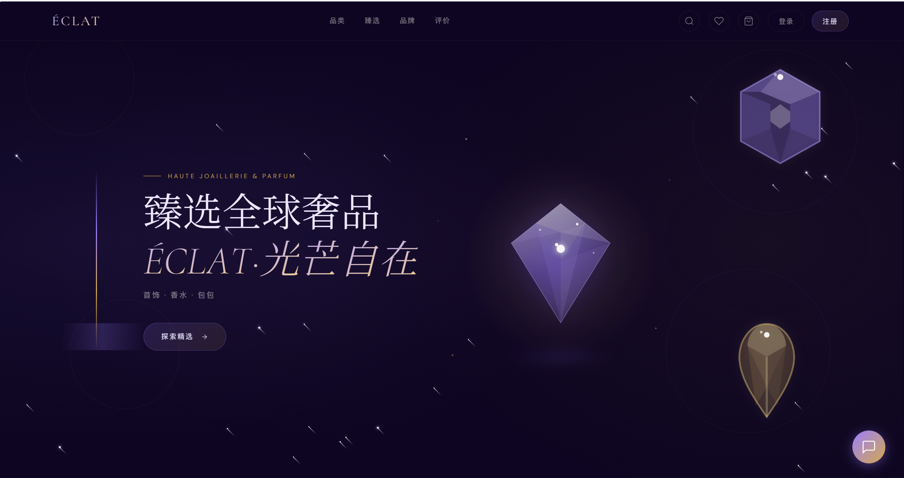
         <b>ÉCLAT</b>
      </a>
       巷陌离
    </td>
    <td align="center" width="25%" valign="top">
      <a href="./prompts/city-trace.md">
        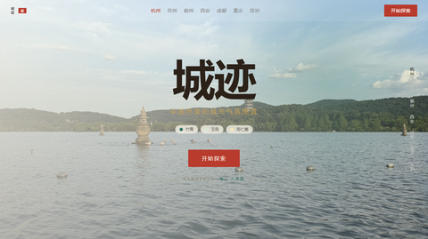
         <b>城迹 City Trace</b>
      </a>
       qinxin
    </td>
    <td align="center" width="25%" valign="top">
      <a href="./prompts/li-zi-liu-guang-ni-ming-xin-xi-chi-wang.md">
        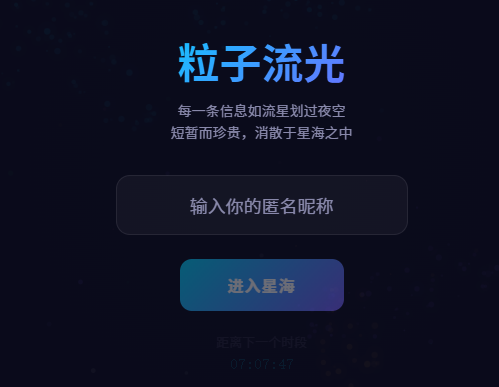
         <b>粒子流光·匿名信息池网</b>
      </a>
       可乐
    </td>
    <td align="center" width="25%" valign="top">
      <a href="./prompts/gan-po-xun-zong-jiang-xi-lv-you-dao-lan.md">
        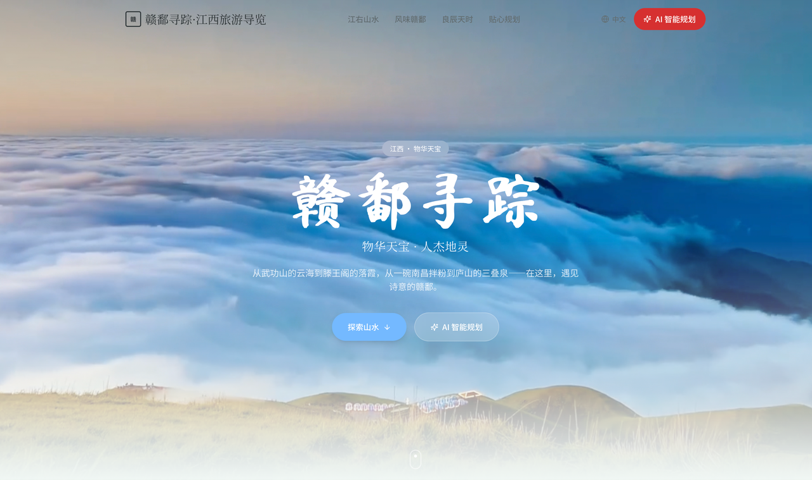
         <b>赣鄱寻踪·江西旅游导览</b>
      </a>
       高承旭
    </td>
  </tr>
</table>

#### 📋 Prompts 完整列表

| 名称 | 作者 |
|---|---|
| [Pawsome](./prompts/pawsome.md) | EdgeOne · [@TencentEdgeOne](https://github.com/TencentEdgeOne) |
| [luxury perfume](./prompts/luxury-perfume.md) | EdgeOne · [@TencentEdgeOne](https://github.com/TencentEdgeOne) |
| [AI wallpaper generator](./prompts/lumina-walls.md) | EdgeOne · [@TencentEdgeOne](https://github.com/TencentEdgeOne) |
| [Start Somewhere](./prompts/start-somewhere.md) | EdgeOne · [@TencentEdgeOne](https://github.com/TencentEdgeOne) |
| [DramaAI](./prompts/drama-ai.md) | EdgeOne · [@TencentEdgeOne](https://github.com/TencentEdgeOne) |
| [Maison Perle](./prompts/maison-perle.md) | EdgeOne · [@TencentEdgeOne](https://github.com/TencentEdgeOne) |
| [会呼吸的"数字宣纸"](./prompts/hui-hu-xi-de-shu-zi-xuan-zhi.md) | lukas |
| [饰品独立网站](./prompts/shi-pin-du-li-wang-zhan.md) | winna · [@winna1813](https://github.com/winna1813) |
| [ProductLens](./prompts/productlens.md) | 临渊不羡鱼 |
| [情绪调色盘](./prompts/qing-xu-tiao-se-pan.md) | ahu |
| [Maison Table](./prompts/maison-table.md) | 社君 |
| [茗韵（Ming Yun Tea）](./prompts/ming-yun-tea.md) | English 糕手 · [@supermanlyc](https://github.com/supermanlyc) |
| [展馆预约](./prompts/zhan-guan-yu-yue.md) | 厚重的中国文物 · [@Yuanyi](https://github.com/Yuanyi) |
| [病历智能识别系统](./prompts/bing-li-zhi-neng-shi-bie-xi-tong.md) | winna · [@winna1813](https://github.com/winna1813) |
| [Nexus Galaxy](./prompts/nexus-galaxy.md) | 努力只够及格，拼命才会赢 · [@wushdd](https://github.com/wushdd) |
| [筑境设计全栈作品集网站](./prompts/zhu-jing-she-ji-quan-zhan-zuo-pin-ji-wang-zhan.md) | 姜子的认知课 · [@JPPgithub666](https://github.com/JPPgithub666) |
| [光影集](./prompts/guang-ying-ji.md) | 郑在笑 · [@zzx8876562](https://github.com/zzx8876562) |
| [TrailAI](./prompts/trailai.md) | 小民 · [@haiming236](https://github.com/haiming236) |
| [RobotBP](./prompts/robotbp.md) | 迪慢慢 |
| [LoveDCE](./prompts/lovedce.md) | Nickel · [@https://gitee.com/SatNickel/love-dce 后续再提交GitHub的网址](https://github.com/https://gitee.com/SatNickel/love-dce 后续再提交GitHub的网址) |
| [个人网页](./prompts/ge-ren-wang-ye.md) | 涛 · [@tao4060810](https://github.com/tao4060810) |
| [炫酷科技风个人主页](./prompts/xuan-ku-ke-ji-feng-ge-ren-zhu-ye.md) | 未迟 · [@weichiAI](https://github.com/weichiAI) |
| [中原纪](./prompts/zhong-yuan-ji.md) | 昏黎 · [@https://github.com/HunLi-X](https://github.com/https://github.com/HunLi-X) |
| [粒子宇宙](./prompts/li-zi-yu-zhou.md) | 陈萌 · [@23400166@qq.com](https://github.com/23400166@qq.com) |
| [LaunchKit AI](./prompts/launchkit-ai.md) | Field · [@niehaotian95](https://github.com/niehaotian95) |
| [心跳守护者](./prompts/xin-tiao-shou-hu-zhe.md) | 此木是才 · [@610452759](https://github.com/610452759) |
| [省Token神器](./prompts/mars-token.md) | maohua |
| [六大维度健康整合评估可视化报告](./prompts/liu-da-wei-du-jian-kang-zheng-he-ping-gu-ke-shi-hu.md) | HH101 · [@qq8147830](https://github.com/qq8147830) |
| [顶奢品牌展示页](./prompts/ding-she-pin-pai-zhan-shi-ye.md) | 时间煮魚 · [@caohanyi358-commits](https://github.com/caohanyi358-commits) |
| [一款通用互动人格测试网站生成器](./prompts/yi-kuan-tong-yong-hu-dong-ren-ge-ce-shi-wang-zhan-.md) | 橙元 · [@1](https://github.com/1) |
| [快递小哥接单小程序](./prompts/kuai-di-xiao-ge-jie-dan-xiao-cheng-xu.md) | 周明 |
| [财务尽调SOP执行助手](./prompts/sop-engine.md) | April · [@April](https://github.com/April) |
| [LUXE MOTOR](./prompts/luxe-motor.md) | 轻池 |
| [如果互联网消失，你还剩下谁](./prompts/ru-guo-hu-lian-wang-xiao-shi-ni-hai-sheng-xia-shui.md) | 反 |
| [宝可梦卡牌抽卡模拟器](./prompts/bao-ke-meng-ka-pai-chou-ka-mo-ni-qi.md) | 胡岚 |
| [人情温度计](./prompts/ren-qing-wen-du-ji.md) | Knox · [@Juice8610](https://github.com/Juice8610) |
| [高定女装官网](./prompts/gao-ding-nv-zhuang-guan-wang.md) | 吴昊 · [@dysonai](https://github.com/dysonai) |
| [智慧班级抽奖系统](./prompts/zhi-hui-ban-ji-chou-jiang-xi-tong.md) | cici · [@SamZig](https://github.com/SamZig) |
| [杭州地产智图](./prompts/hang-zhou-di-chan-zhi-tu.md) | 限定设计 |
| [健康科普网站](./prompts/jian-kang-ke-pu-wang-zhan.md) | TK |
| [极简个人博客](./prompts/ji-jian-ge-ren-bo-ke.md) | 苏不不不酥 · [@Senguk](https://github.com/Senguk) |
| [数字柚子](./prompts/shu-zi-you-zi.md) | 小柚子 · [@YouzSpace](https://github.com/YouzSpace) |
| [Academic Hub](./prompts/academic-hub.md) | 榆鸑 · [@zixilee666-svg](https://github.com/zixilee666-svg) |
| [个人作品集网站](./prompts/ge-ren-zuo-pin-ji-wang-zhan.md) | xcsoft · [@soxft](https://github.com/soxft) |
| [各地文旅足球赛的网页](./prompts/ge-di-wen-lv-zu-qiu-sai-de-wang-ye.md) | Leon · [@Leon0019](https://github.com/Leon0019) |
| [Breakout Legend — 打砖块小游戏](./prompts/breakout-legend.md) | qjh · [@jiahui-qin](https://github.com/jiahui-qin) |
| [Global Vehicle Mall](./prompts/global-vehicle-mall.md) | 不吃小鱼干 |
| [优生优育网站](./prompts/you-sheng-you-yu-wang-zhan.md) | 道请居士 |
| [猫岛 Cloud Haven](./prompts/cloud-haven.md) | 老腊肉大师兄 |
| [Eve Tan: Edge of Architecture](./prompts/eve-tan-edge-of-architecture.md) | 谭彦文 |
| [图书管理系统](./prompts/tu-shu-guan-li-xi-tong.md) | 六月的雨在Tencent |
| [璆琳](./prompts/qiu-lin.md) | 张艳 · [@https://github.com/midezhang](https://github.com/https://github.com/midezhang) |
| [旅迹 · 实景旅游指南](./prompts/lv-ji-shi-jing-lv-you-zhi-nan.md) | 卢廷皓 |
| [消失的行当](./prompts/xiao-shi-de-hang-dang.md) | 贺玉涵 · [@fanhua789](https://github.com/fanhua789) |
| [AI灵感阁](./prompts/ai-bao-mu.md) | ACoding · [@sunshellwang](https://github.com/sunshellwang) |
| [沉浸式AI艺术画廊网站](./prompts/ai-75.md) | 朴 · [@hueidou](https://github.com/hueidou) |
| [网页 PPT 生成方案](./prompts/ppt-generator.md) | s1eke · [@s1eke](https://github.com/s1eke) |
| [衣服售卖淘宝卖家网页](./prompts/yi-fu-shou-mai-tao-bao-mai-jia-wang-ye.md) | Alex |
| [Museum · 个人作品博物馆](./prompts/museum.md) | 黄梓庭 · [@beiyuii](https://github.com/beiyuii) |
| [落地页转化率医生](./prompts/luo-di-ye-zhuan-hua-lv-yi-sheng.md) | 谭昊 · [@jjbudy84](https://github.com/jjbudy84) |
| [粒子流体交响曲](./prompts/li-zi-liu-ti-jiao-xiang-qu.md) | 于鸿伟 · [@hongwei-2026](https://github.com/hongwei-2026) |
| [教案设计智能助手](./prompts/jiao-an-she-ji-zhi-neng-zhu-shou.md) | Manci-Lu · [@manci-lu](https://github.com/manci-lu) |
| [随机吃](./prompts/sui-ji-chi.md) | 刘瑜 |
| [FlowMate](./prompts/flowmate.md) | 陈晓捷（牛顿） · [@new6881-boop](https://github.com/new6881-boop) |
| [MARGINALIA（旁注）](./prompts/marginalia.md) | ntptc · [@ntptc](https://github.com/ntptc) |
| [午饭摇号系统](./prompts/wu-fan-yao-hao-xi-tong.md) | Adularia |
| [山海经异兽档案馆](./prompts/shan-hai-jing-yi-shou-dang-an-guan.md) | 深夜程序员 |
| [Brochure Mobile](./prompts/brochure-mobile.md) | 郑坚兵 · [@h5wawaji](https://github.com/h5wawaji) |
| [律师AI工具箱](./prompts/ai-paint-share.md) | qingyun |
| [Hermes Agent智能代理](./prompts/hermes-agent.md) | CaVaN_9 · [@Cavan-Ou](https://github.com/Cavan-Ou) |
| [BEAN JOURNEY](./prompts/bean-journey.md) | 曾卉 · [@77552882@qq.com](https://github.com/77552882@qq.com) |
| [Soul 测试台](./prompts/soul-trace.md) | Senkawa · [@senkawa_chie@hotmail.com](https://github.com/senkawa_chie@hotmail.com) |
| [一山的日记 · Diary World](./prompts/diary-world.md) | 见山又一山 |
| [运河·福寿居康养中心](./prompts/yun-he-fu-shou-ju-kang-yang-zhong-xin.md) | 高宽 |
| [AI Avatar Pro](./prompts/ai-avatar-pro.md) | 庞通 · [@pangtongya](https://github.com/pangtongya) |
| [二次元风格个人博客](./prompts/er-ci-yuan-feng-ge-ge-ren-bo-ke.md) | 蒲浩 · [@SpiritoXI](https://github.com/SpiritoXI) |
| [One-Person Company Mission Control](./prompts/one-person-company-mission-control.md) | Savio · [@savio1022](https://github.com/savio1022) |
| [Inkling](./prompts/inkling.md) | RunnerQuan · [@RunnerQuan](https://github.com/RunnerQuan) |
| [知鱼答题小程序](./prompts/zhi-yu-da-ti-xiao-cheng-xu.md) | trylab |
| [Echo](./prompts/echo-app.md) | FKL · [@FKL](https://github.com/FKL) |
| [Node \| 原点](./prompts/node-blog.md) | 木白_BYMU · [@BYMU0910](https://github.com/BYMU0910) |
| [One-Person Company Mission Control](./prompts/one-person-company-mission-control-114.md) | Savio · [@savio1022](https://github.com/savio1022) |
| [广州市增城庆益真空泵经营部官网首页](./prompts/guang-zhou-shi-zeng-cheng-qing-yi-zhen-kong-beng-j.md) | 益智 |
| [专属驾驶舱](./prompts/zhuan-shu-jia-shi-cang.md) | Renee · [@superrenee](https://github.com/superrenee) |
| [DreamyBot Studio](./prompts/dreamybot-studio.md) | dreamybot · [@dreamybot](https://github.com/dreamybot) |
| [智能招聘仪表盘](./prompts/zhi-neng-zhao-pin-yi-biao-pan.md) | 严学峰 · [@yanxuefengyan](https://github.com/yanxuefengyan) |
| [NomadPort —— 数字游民作品集](./prompts/nomadport.md) | 严学峰 · [@yanxuefeng](https://github.com/yanxuefeng) |
| [LandscapeFlow AI](./prompts/landscapeflow-ai.md) | 李博 · [@xixi241225-crypto](https://github.com/xixi241225-crypto) |
| [NexusChat](./prompts/nexuschat.md) | 蜗牛 · [@Mr-xxp](https://github.com/Mr-xxp) |
| [PetVibe](./prompts/petvibe.md) | bobo · [@zipporcui](https://github.com/zipporcui) |
| [AI 选址助手](./prompts/ai-127.md) | 木斯佳 · [@sakurajiajia](https://github.com/sakurajiajia) |
| [个人作品集](./prompts/ge-ren-zuo-pin-ji.md) | 贺国雄 · [@peterdog666](https://github.com/peterdog666) |
| [LUCID/01](./prompts/lucid-01.md) | 张miao · [@zhangmiao03](https://github.com/zhangmiao03) |
| [云莱掌柜企业官网](./prompts/yun-lai-zhang-gui-qi-ye-guan-wang.md) | 陈龙 · [@陈59157](https://github.com/陈59157) |
| [OpsVision](./prompts/opsvision.md) | wuyafeiya |
| [科技探险家](./prompts/ke-ji-tan-xian-jia.md) | 洋 |
| [NetKeeper](./prompts/netkeeper.md) | 幽静森林 |
| [鲤上元](./prompts/li-shang-yuan.md) | 杨舒恒 |
| [LandscapeFlow AI](./prompts/landscapeflow-ai-145.md) | 李博 · [@xixi241225-crypto](https://github.com/xixi241225-crypto) |
| [ChipAgent Pro](./prompts/chipagent-pro.md) | 殷巍 |
| [花语世界](./prompts/hua-yu-shi-jie.md) | sia不是cia |
| [LifeClock](./prompts/lifeclock.md) | 陈海健 |
| [奇妙设计官网](./prompts/qi-miao-she-ji-guan-wang.md) | 邹钰明 · [@zouyuming](https://github.com/zouyuming) |
| [决策沙盘](./prompts/jue-ce-sha-pan-154.md) | 硅蜜 · [@hjsjtu826](https://github.com/hjsjtu826) |
| [云轴 CloudScroll](./prompts/cloudscroll.md) | kevin · [@kevin](https://github.com/kevin) |
| [NEXUS AI](./prompts/nexus-ai.md) | 青衣鸿 · [@qy007h](https://github.com/qy007h) |
| [AITourSage Pro](./prompts/aitoursage-pro.md) | 90后的00鉌枝铢 |
| [人物千秋](./prompts/ren-wu-qian-qiu.md) | 振一 · [@lzymmmm-droid](https://github.com/lzymmmm-droid) |
| [中国邮政 × 高考主题](./prompts/zhong-guo-you-zheng-gao-kao-zhu-ti.md) | 好雨知时节 · [@warfieldodakaclaude8190](https://github.com/warfieldodakaclaude8190) |
| [学习羽毛球挥拍动作](./prompts/xue-xi-yu-mao-qiu-hui-pai-dong-zuo.md) | 郎咸蒙 · [@FatherOfMS](https://github.com/FatherOfMS) |
| [生成审美在线的创意网页](./prompts/sheng-cheng-shen-mei-zai-xian-de-chuang-yi-wang-ye.md) | nekomm |
| [Daily Buzz](./prompts/daily-buzz.md) | 寒木 |
| [ÉCLAT](./prompts/clat-saas.md) | 巷陌离 · [@xxx-web](https://github.com/xxx-web) |
| [城迹 City Trace](./prompts/city-trace.md) | qinxin · [@qinxin111](https://github.com/qinxin111) |
| [粒子流光·匿名信息池网](./prompts/li-zi-liu-guang-ni-ming-xin-xi-chi-wang.md) | 可乐 |
| [赣鄱寻踪·江西旅游导览](./prompts/gan-po-xun-zong-jiang-xi-lv-you-dao-lan.md) | 高承旭 |

---

### 🛠️ Skills 赛道（50 件）

> 点击封面 → 跳转作品详情页查看完整 Skill 说明

<table>
  <tr>
    <td align="center" width="25%" valign="top">
      <a href="./skills/restaurant-booking-skill.md">
        
         <b>restaurant-booking-skill</b>
      </a>
       社君
    </td>
    <td align="center" width="25%" valign="top">
      <a href="./skills/neway-commerce-os.md">
        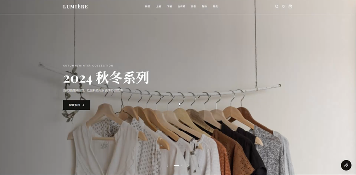
         <b>Neway Commerce OS</b>
      </a>
       刘滔滔
    </td>
    <td align="center" width="25%" valign="top">
      <a href="./skills/renthub.md">
        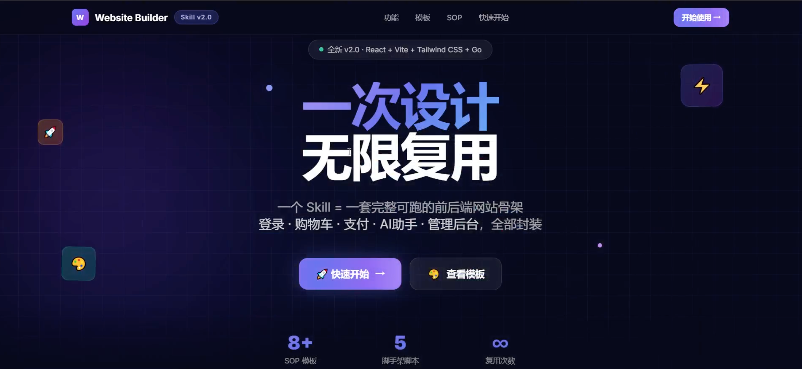
         <b>RentHub 商城</b>
      </a>
       小民
    </td>
    <td align="center" width="25%" valign="top">
      <a href="./skills/ai-saas.md">
        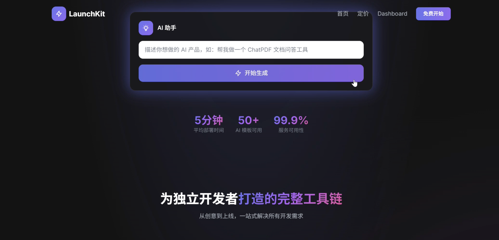
         <b>AI 微型 SaaS</b>
      </a>
       Field
    </td>
  </tr>
  <tr>
    <td align="center" width="25%" valign="top">
      <a href="./skills/website-skeleton-skill.md">
        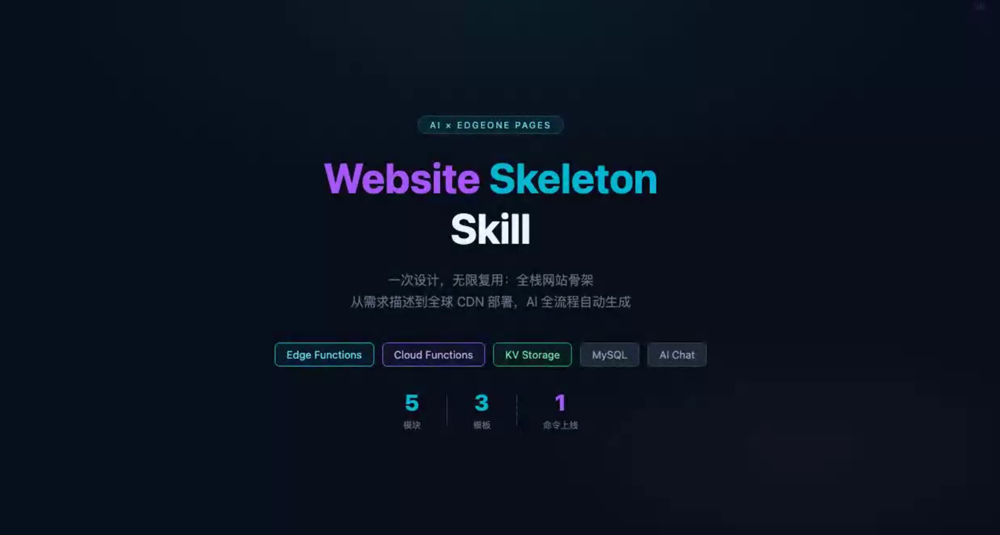
         <b>Website Skeleton Skill</b>
      </a>
       刘博
    </td>
    <td align="center" width="25%" valign="top">
      <a href="./skills/ai-skill.md">
        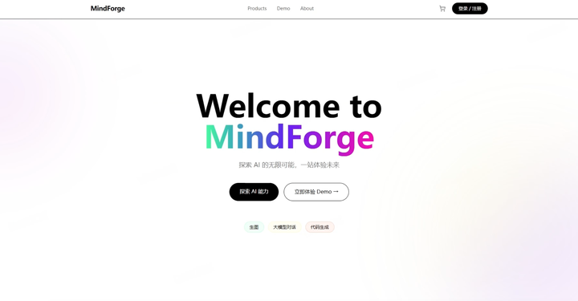
         <b>AI 聚合展示平台 Skill</b>
      </a>
       苏逸
    </td>
    <td align="center" width="25%" valign="top">
      <a href="./skills/ming-yun-tea-48.md">
        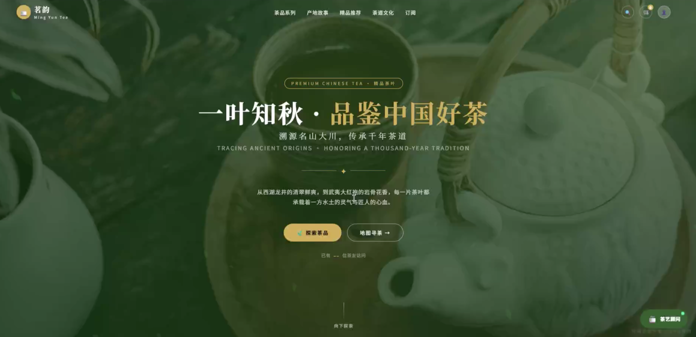
         <b>茗韵（Ming Yun Tea）</b>
      </a>
       English 糕手
    </td>
    <td align="center" width="25%" valign="top">
      <a href="./skills/ru-guo-hu-lian-wang-xiao-shi-ni-hai-sheng-xia-shui-51.md">
        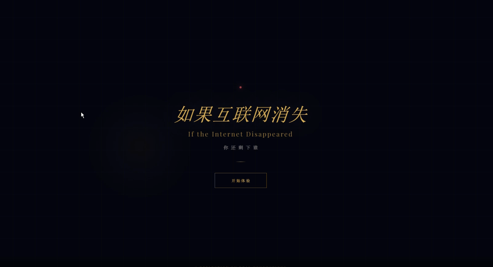
         <b>如果互联网消失，你还剩下谁</b>
      </a>
       反
    </td>
  </tr>
  <tr>
    <td align="center" width="25%" valign="top">
      <a href="./skills/token-save.md">
        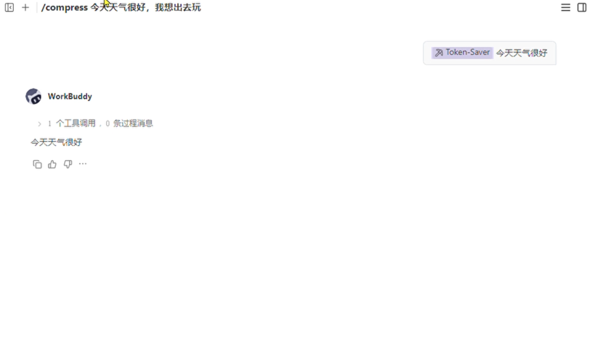
         <b>token-save</b>
      </a>
       zhu iris
    </td>
    <td align="center" width="25%" valign="top">
      <a href="./skills/pages-skill.md">
        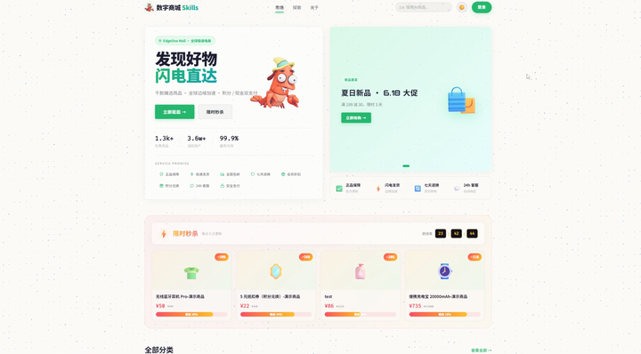
         <b>pages 全栈商城 skill</b>
      </a>
       罗丰才
    </td>
    <td align="center" width="25%" valign="top">
      <a href="./skills/lv-ji-rou-mian.md">
        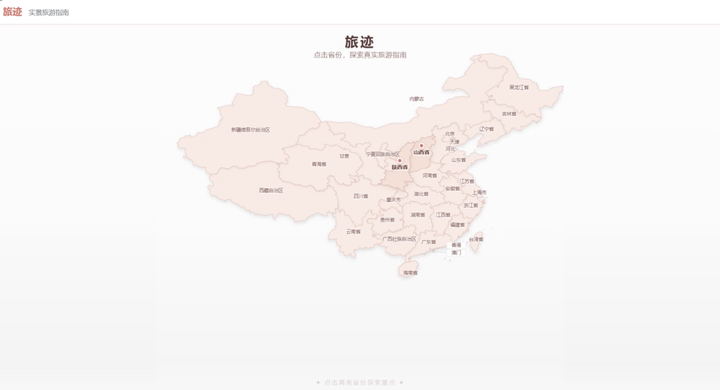
         <b>旅迹</b>
      </a>
       卢廷皓
    </td>
    <td align="center" width="25%" valign="top">
      <a href="./skills/hui-lian-yi-fei-yong-bao-xiao.md">
        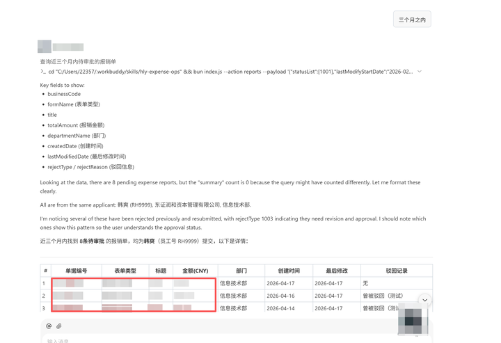
         <b>汇联易费用报销</b>
      </a>
       阿臻
    </td>
  </tr>
  <tr>
    <td align="center" width="25%" valign="top">
      <a href="./skills/tax-skill.md">
        
         <b>断舍离 Skill</b>
      </a>
       赵燕茹
    </td>
    <td align="center" width="25%" valign="top">
      <a href="./skills/union-pan.md">
        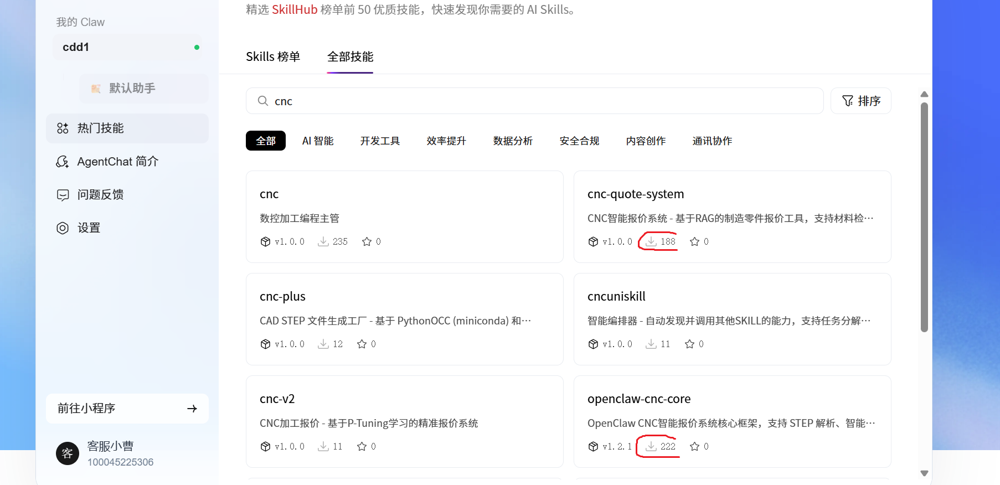
         <b>Union·由你</b>
      </a>
       timo曹冬冬
    </td>
    <td align="center" width="25%" valign="top">
      <a href="./skills/tech-stack-analyzer-skill.md">
        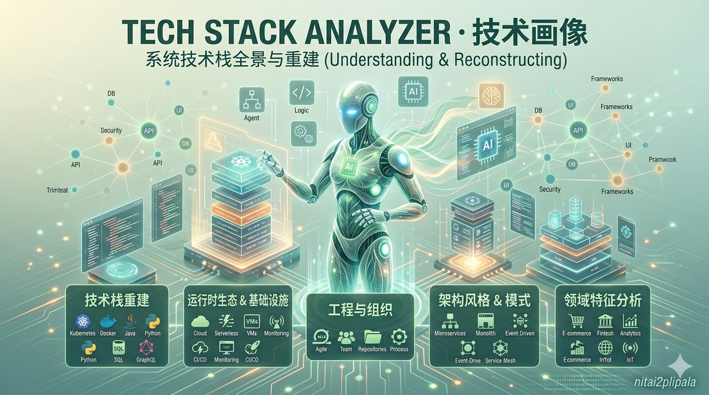
         <b>Tech Stack Analyzer Skill</b>
      </a>
       朱皮
    </td>
    <td align="center" width="25%" valign="top">
      <a href="./skills/ai-76.md">
        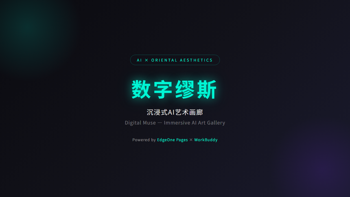
         <b>沉浸式AI艺术画廊网站</b>
      </a>
       朴
    </td>
  </tr>
  <tr>
    <td align="center" width="25%" valign="top">
      <a href="./skills/datalens.md">
        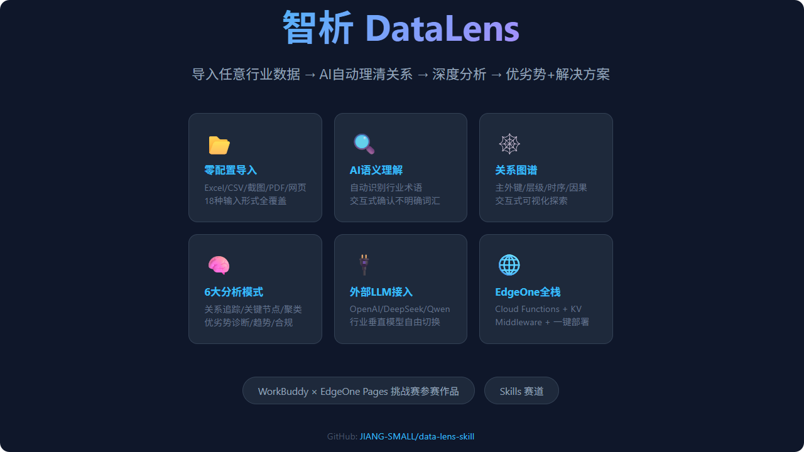
         <b>智析 DataLens</b>
      </a>
       阳光的味道
    </td>
    <td align="center" width="25%" valign="top">
      <a href="./skills/noc-events.md">
        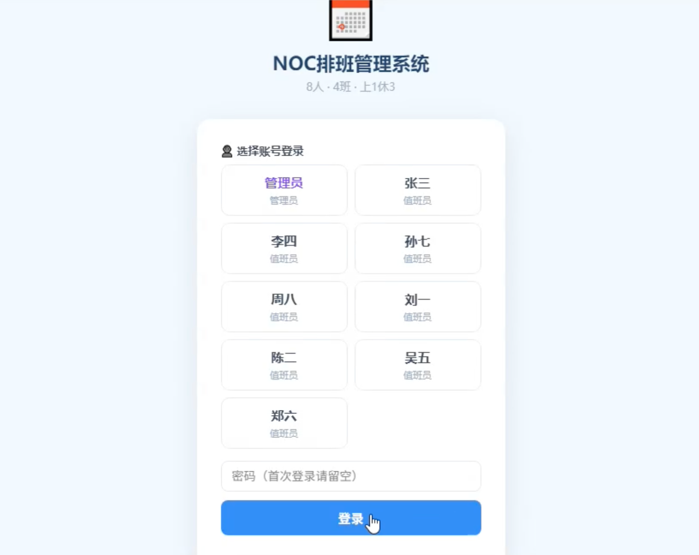
         <b>NOC排班管理系统</b>
      </a>
       搏击长空
    </td>
    <td align="center" width="25%" valign="top">
      <a href="./skills/fei-zhan.md">
        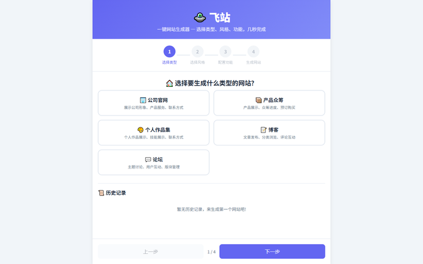
         <b>飞站</b>
      </a>
       航空养虾人
    </td>
    <td align="center" width="25%" valign="top">
      <a href="./skills/multi-agent.md">
        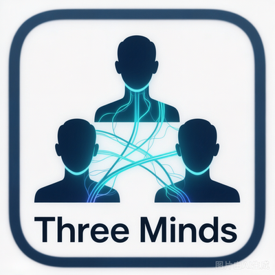
         <b>原生多 Agent 协作技能</b>
      </a>
       飞天的土豆
    </td>
  </tr>
  <tr>
    <td align="center" width="25%" valign="top">
      <a href="./skills/skill-89.md">
        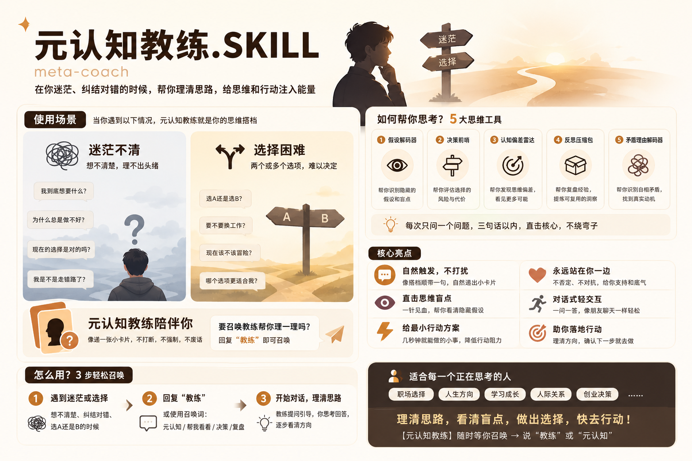
         <b>元认知教练.skill</b>
      </a>
       咸鱼爸
    </td>
    <td align="center" width="25%" valign="top">
      <a href="./skills/edgeone-market-story-lab.md">
        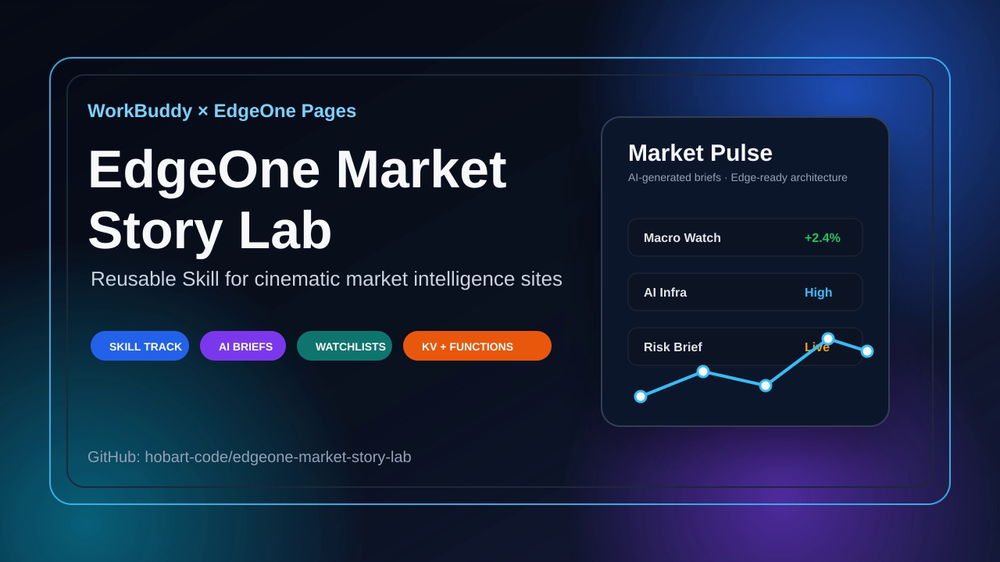
         <b>EdgeOne Market Story Lab</b>
      </a>
       hobartguo
    </td>
    <td align="center" width="25%" valign="top">
      <a href="./skills/wu-fan-yao-hao-xi-tong-93.md">
        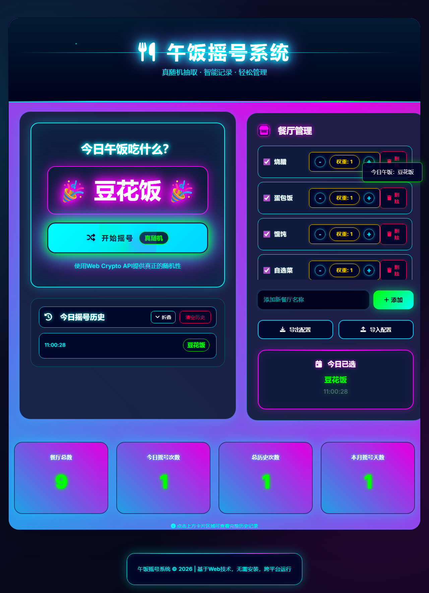
         <b>午饭摇号系统</b>
      </a>
       Adularia
    </td>
    <td align="center" width="25%" valign="top">
      <a href="./skills/ai-saas-builder.md">
        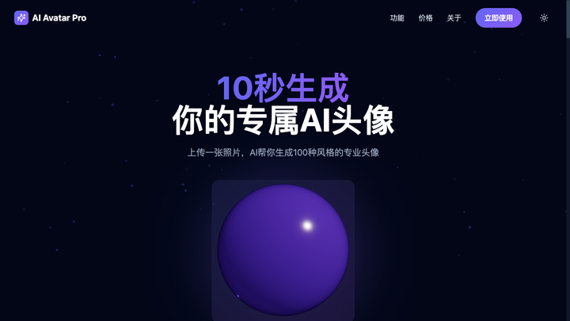
         <b>AI SaaS Builder</b>
      </a>
       庞通
    </td>
  </tr>
  <tr>
    <td align="center" width="25%" valign="top">
      <a href="./skills/sui-ji-chi-98.md">
        
         <b>随机吃</b>
      </a>
       刘瑜
    </td>
    <td align="center" width="25%" valign="top">
      <a href="./skills/birthday-wish-generator.md">
        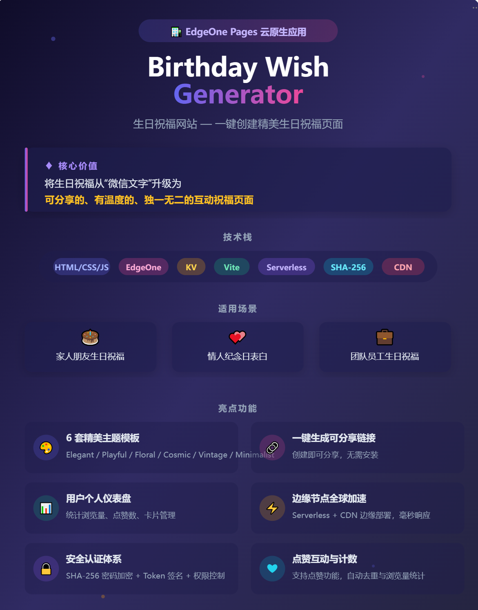
         <b>Birthday Wish Generator</b>
      </a>
       qjh
    </td>
    <td align="center" width="25%" valign="top">
      <a href="./skills/edgeone-pages.md">
        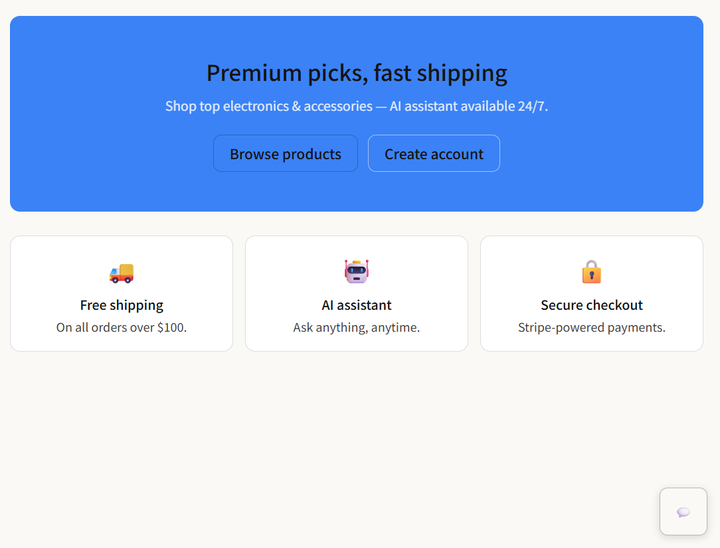
         <b>EdgeOne Pages 全栈站点能力</b>
      </a>
       Alan
    </td>
    <td align="center" width="25%" valign="top">
      <a href="./skills/academic-hub-skills.md">
        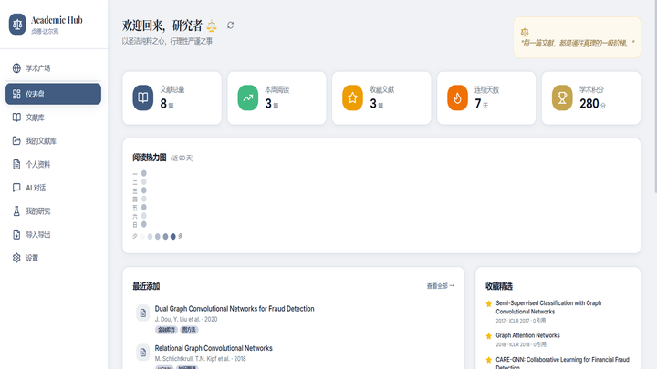
         <b>Academic Hub Skills</b>
      </a>
       榆鸑
    </td>
  </tr>
  <tr>
    <td align="center" width="25%" valign="top">
      <a href="./skills/dreamybot-studio-118.md">
        
         <b>DreamyBot Studio</b>
      </a>
       dreamybot
    </td>
    <td align="center" width="25%" valign="top">
      <a href="./skills/skill-120.md">
        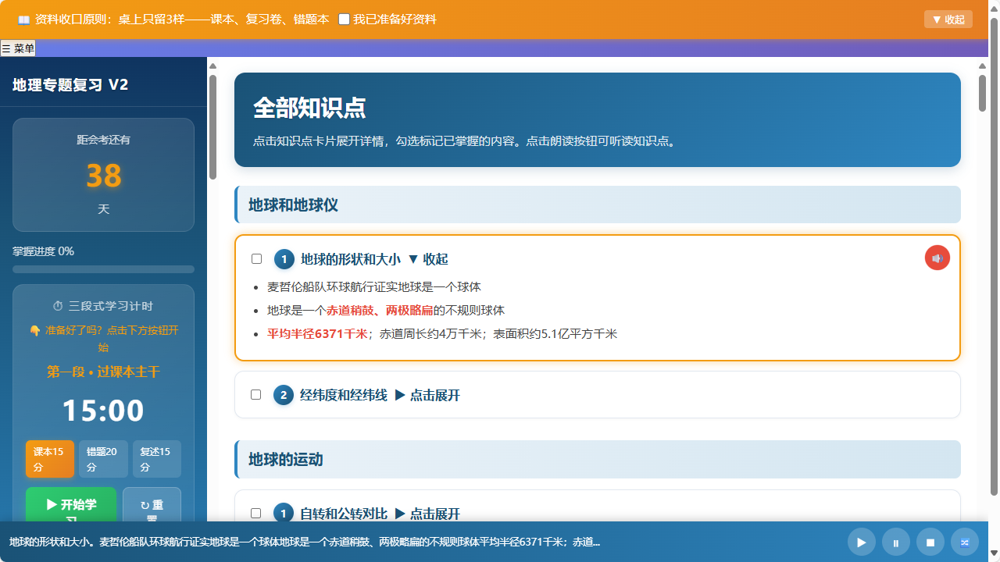
         <b>书杰学习系统生成 Skill 套装</b>
      </a>
       Renee
    </td>
    <td align="center" width="25%" valign="top">
      <a href="./skills/nomadport-122.md">
        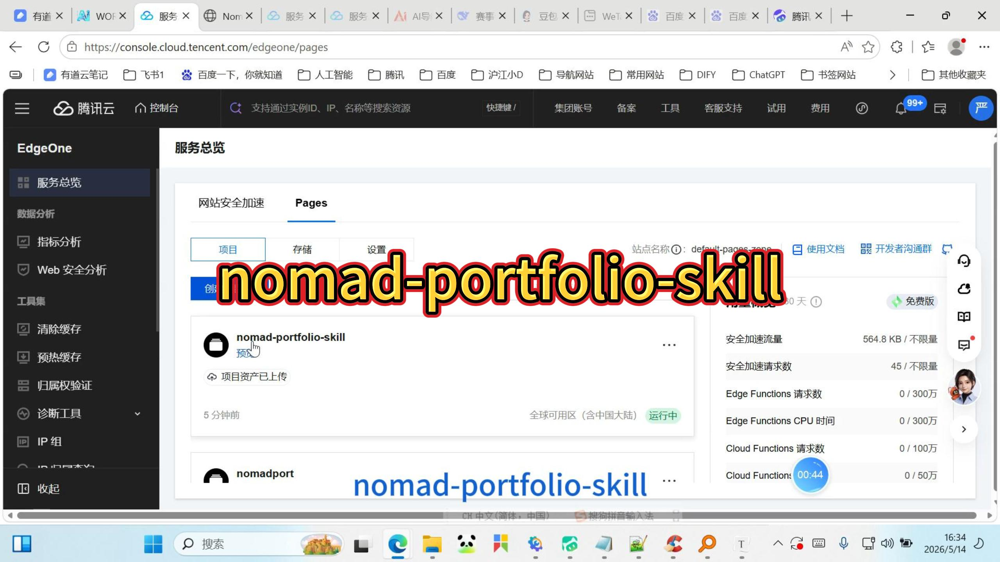
         <b>NomadPort</b>
      </a>
       严学峰
    </td>
    <td align="center" width="25%" valign="top">
      <a href="./skills/nexuschat-125.md">
        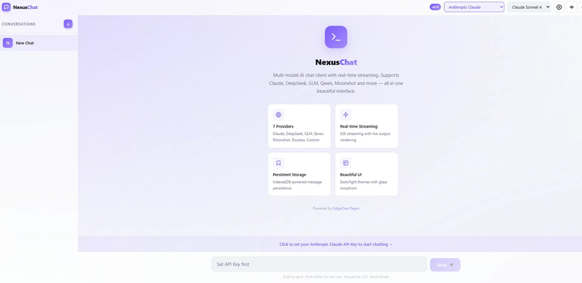
         <b>NexusChat</b>
      </a>
       蜗牛
    </td>
  </tr>
  <tr>
    <td align="center" width="25%" valign="top">
      <a href="./skills/wang-ye-she-ji-xiang-dao-ji-neng.md">
        
         <b>网页设计向导技能</b>
      </a>
       王建斌
    </td>
    <td align="center" width="25%" valign="top">
      <a href="./skills/ying-shi-hua-quan-liu-cheng-zhi-neng-chuang-zuo-zh.md">
        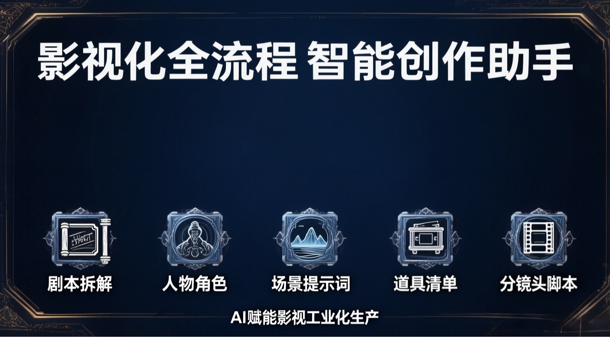
         <b>影视化全流程智能创作助手</b>
      </a>
       石头
    </td>
    <td align="center" width="25%" valign="top">
      <a href="./skills/coffee-wed-skills.md">
        
         <b>Coffee-Wed-Skills</b>
      </a>
       Z老师
    </td>
    <td align="center" width="25%" valign="top">
      <a href="./skills/ai-writing-assistant-saas-skill.md">
        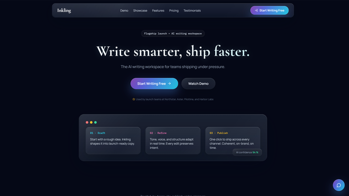
         <b>ai-writing-assistant-saas-skill</b>
      </a>
       RunnerQuan
    </td>
  </tr>
  <tr>
    <td align="center" width="25%" valign="top">
      <a href="./skills/xiao-yuan-ying-jie-sheng-qiu-zhi-fu-wu-quan-zhan-w.md">
        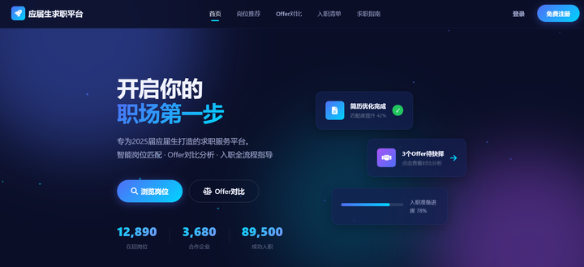
         <b>校园应届生求职服务全栈网站</b>
      </a>
       贺国雄
    </td>
    <td align="center" width="25%" valign="top">
      <a href="./skills/thesis-master.md">
        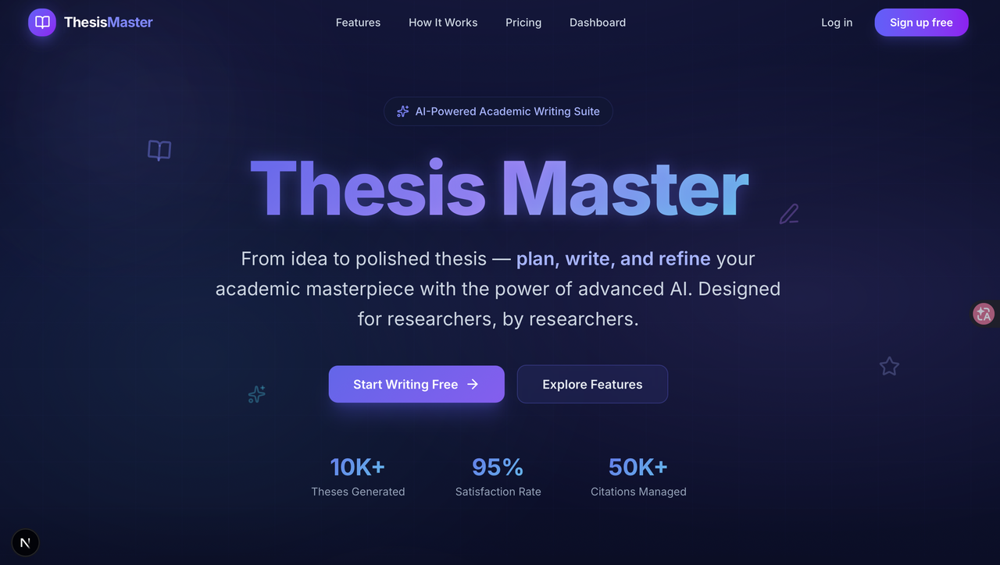
         <b>Thesis Master</b>
      </a>
       江峰
    </td>
    <td align="center" width="25%" valign="top">
      <a href="./skills/zheng-ce-zhi-shi-xue-xi-ping-tai.md">
        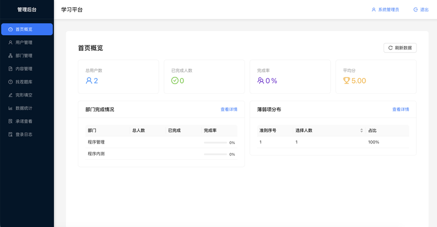
         <b>政策知识学习平台</b>
      </a>
       Zhang Qin
    </td>
    <td align="center" width="25%" valign="top">
      <a href="./skills/soul-137.md">
        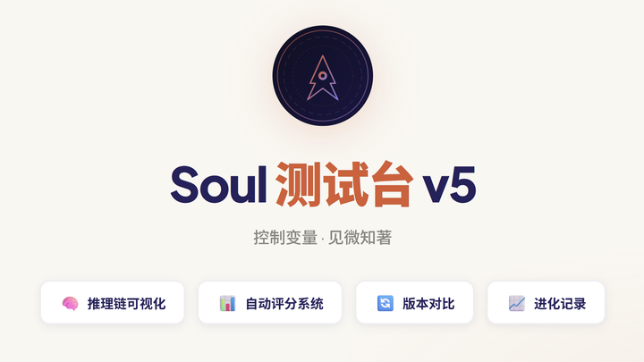
         <b>Soul 测试台</b>
      </a>
       Senkawa
    </td>
  </tr>
  <tr>
    <td align="center" width="25%" valign="top">
      <a href="./skills/work-142.md">
        
         <b>（未命名）</b>
      </a>
       幽静森林
    </td>
    <td align="center" width="25%" valign="top">
      <a href="./skills/portfolioflow.md">
        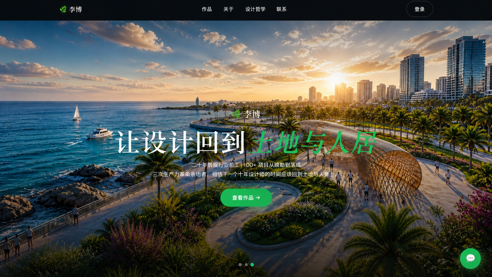
         <b>PortfolioFlow</b>
      </a>
       李博
    </td>
    <td align="center" width="25%" valign="top">
      <a href="./skills/dian-ying-gan-yu-yue-guan-wang-sheng-cheng-qi.md">
        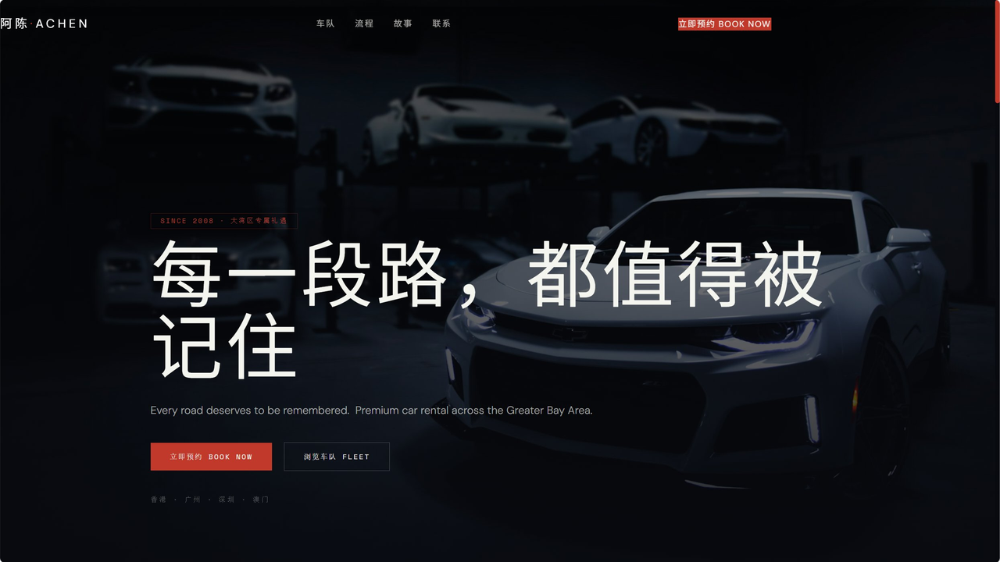
         <b>电影感预约官网生成器</b>
      </a>
       Hoikin
    </td>
    <td align="center" width="25%" valign="top">
      <a href="./skills/chipagent-pro-148.md">
        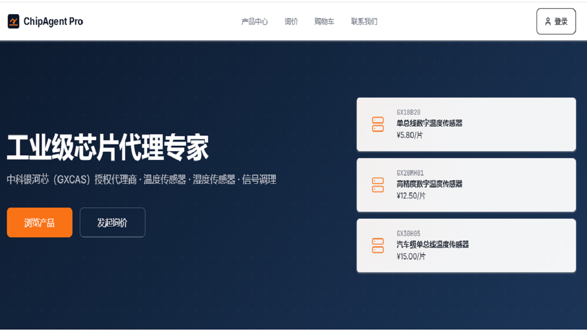
         <b>ChipAgent Pro</b>
      </a>
       殷巍
    </td>
  </tr>
  <tr>
    <td align="center" width="25%" valign="top">
      <a href="./skills/opc-site.md">
        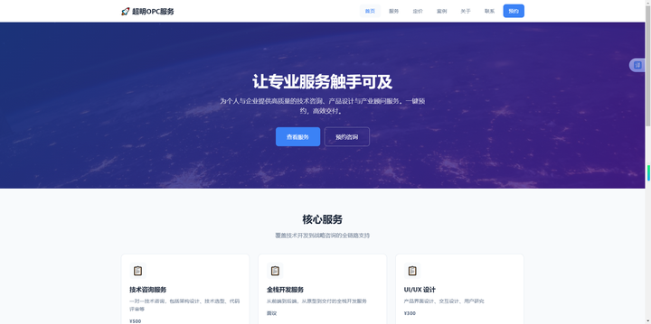
         <b>OPC-site</b>
      </a>
       陈超明
    </td>
    <td align="center" width="25%" valign="top">
      <a href="./skills/jue-ce-sha-pan.md">
        
         <b>决策沙盘</b>
      </a>
       硅蜜
    </td>
    <td align="center" width="25%" valign="top">
      <a href="./skills/ren-wu-qian-qiu-161.md">
        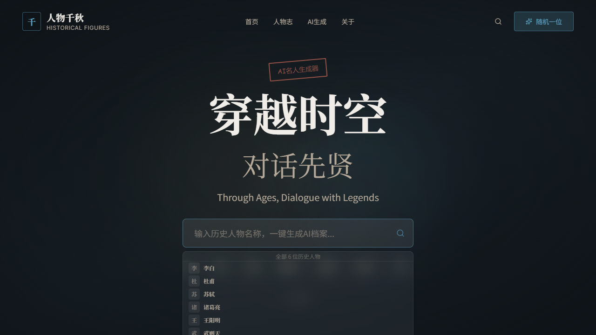
         <b>人物千秋</b>
      </a>
       振一
    </td>
    <td align="center" width="25%" valign="top">
      <a href="./skills/webcraft.md">
        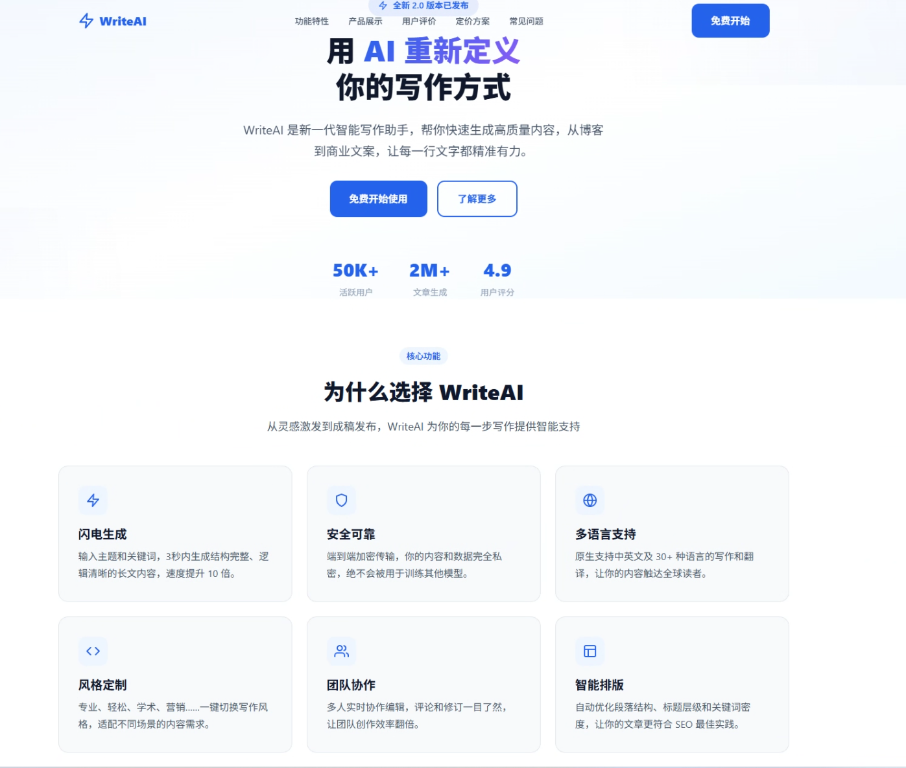
         <b>WebCraft</b>
      </a>
       nekomm
    </td>
  </tr>
  <tr>
    <td align="center" width="25%" valign="top">
      <a href="./skills/clat-167.md">
        
         <b>ÉCLAT</b>
      </a>
       巷陌离
    </td>
    <td align="center" width="25%" valign="top">
      <a href="./skills/saas-landing-page-generator.md">
        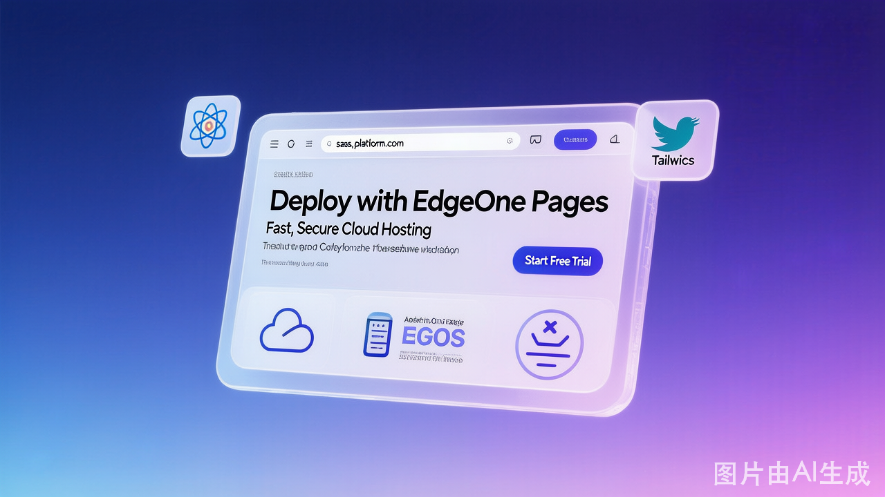
         <b>SaaS Landing Page Generator</b>
      </a>
       林小侠
    </td>
    <td align="center" width="25%"></td>
    <td align="center" width="25%"></td>
  </tr>
</table>

#### 📋 Skills 完整列表

| 名称 | 作者 |
|---|---|
| [restaurant-booking-skill](./skills/restaurant-booking-skill.md) | 社君 |
| [Neway Commerce OS](./skills/neway-commerce-os.md) | 刘滔滔 · [@lwter](https://github.com/lwter) |
| [RentHub 商城](./skills/renthub.md) | 小民 · [@haiming236](https://github.com/haiming236) |
| [AI 微型 SaaS](./skills/ai-saas.md) | Field · [@niehaotian95](https://github.com/niehaotian95) |
| [Website Skeleton Skill](./skills/website-skeleton-skill.md) | 刘博 · [@liuboacean](https://github.com/liuboacean) |
| [AI 聚合展示平台 Skill](./skills/ai-skill.md) | 苏逸 · [@godsir](https://github.com/godsir) |
| [茗韵（Ming Yun Tea）](./skills/ming-yun-tea-48.md) | English 糕手 · [@supermanlyc](https://github.com/supermanlyc) |
| [如果互联网消失，你还剩下谁](./skills/ru-guo-hu-lian-wang-xiao-shi-ni-hai-sheng-xia-shui-51.md) | 反 |
| [token-save](./skills/token-save.md) | zhu iris |
| [pages 全栈商城 skill](./skills/pages-skill.md) | 罗丰才 · [@erxiansheng](https://github.com/erxiansheng) |
| [旅迹](./skills/lv-ji-rou-mian.md) | 卢廷皓 · [@A-TOM](https://github.com/A-TOM) |
| [汇联易费用报销](./skills/hui-lian-yi-fei-yong-bao-xiao.md) | 阿臻 · [@chengazhen](https://github.com/chengazhen) |
| [断舍离 Skill](./skills/tax-skill.md) | 赵燕茹 · [@rubyzhao666](https://github.com/rubyzhao666) |
| [Union·由你](./skills/union-pan.md) | timo曹冬冬 · [@https://github.com/Timo2026/OpenClaw-CNC-Safe2/tree/main](https://github.com/https://github.com/Timo2026/OpenClaw-CNC-Safe2/tree/main) |
| [Tech Stack Analyzer Skill](./skills/tech-stack-analyzer-skill.md) | 朱皮 · [@nitai2plipala](https://github.com/nitai2plipala) |
| [沉浸式AI艺术画廊网站](./skills/ai-76.md) | 朴 · [@hueidou](https://github.com/hueidou) |
| [智析 DataLens](./skills/datalens.md) | 阳光的味道 · [@JIANG-SMALL](https://github.com/JIANG-SMALL) |
| [NOC排班管理系统](./skills/noc-events.md) | 搏击长空 |
| [飞站](./skills/fei-zhan.md) | 航空养虾人 · [@https://github.com/luckychenxiaowen/sitemaker](https://github.com/https://github.com/luckychenxiaowen/sitemaker) |
| [原生多 Agent 协作技能](./skills/multi-agent.md) | 飞天的土豆 · [@enhiko](https://github.com/enhiko) |
| [元认知教练.skill](./skills/skill-89.md) | 咸鱼爸 |
| [EdgeOne Market Story Lab](./skills/edgeone-market-story-lab.md) | hobartguo |
| [午饭摇号系统](./skills/wu-fan-yao-hao-xi-tong-93.md) | Adularia |
| [AI SaaS Builder](./skills/ai-saas-builder.md) | 庞通 · [@pangtongya](https://github.com/pangtongya) |
| [随机吃](./skills/sui-ji-chi-98.md) | 刘瑜 |
| [Birthday Wish Generator](./skills/birthday-wish-generator.md) | qjh |
| [EdgeOne Pages 全栈站点能力](./skills/edgeone-pages.md) | Alan · [@Ilovecodinghhh](https://github.com/Ilovecodinghhh) |
| [Academic Hub Skills](./skills/academic-hub-skills.md) | 榆鸑 · [@zixilee666-svg](https://github.com/zixilee666-svg) |
| [DreamyBot Studio](./skills/dreamybot-studio-118.md) | dreamybot · [@dreamybot](https://github.com/dreamybot) |
| [书杰学习系统生成 Skill 套装](./skills/skill-120.md) | Renee · [@superrenee](https://github.com/superrenee) |
| [NomadPort](./skills/nomadport-122.md) | 严学峰 · [@yanxuefeng](https://github.com/yanxuefeng) |
| [NexusChat](./skills/nexuschat-125.md) | 蜗牛 · [@Mr-xxp](https://github.com/Mr-xxp) |
| [网页设计向导技能](./skills/wang-ye-she-ji-xiang-dao-ji-neng.md) | 王建斌 |
| [影视化全流程智能创作助手](./skills/ying-shi-hua-quan-liu-cheng-zhi-neng-chuang-zuo-zh.md) | 石头 · [@shiqiang4521](https://github.com/shiqiang4521) |
| [Coffee-Wed-Skills](./skills/coffee-wed-skills.md) | Z老师 · [@77552882@qq.com](https://github.com/77552882@qq.com) |
| [ai-writing-assistant-saas-skill](./skills/ai-writing-assistant-saas-skill.md) | RunnerQuan · [@RunnerQuan](https://github.com/RunnerQuan) |
| [校园应届生求职服务全栈网站](./skills/xiao-yuan-ying-jie-sheng-qiu-zhi-fu-wu-quan-zhan-w.md) | 贺国雄 |
| [Thesis Master](./skills/thesis-master.md) | 江峰 · [@zhabei-luxiaohong](https://github.com/zhabei-luxiaohong) |
| [政策知识学习平台](./skills/zheng-ce-zhi-shi-xue-xi-ping-tai.md) | Zhang Qin · [@Jonykit](https://github.com/Jonykit) |
| [Soul 测试台](./skills/soul-137.md) | Senkawa |
| [（未命名）](./skills/work-142.md) | 幽静森林 |
| [PortfolioFlow](./skills/portfolioflow.md) | 李博 · [@xixi241225-crypto](https://github.com/xixi241225-crypto) |
| [电影感预约官网生成器](./skills/dian-ying-gan-yu-yue-guan-wang-sheng-cheng-qi.md) | Hoikin · [@kin684660](https://github.com/kin684660) |
| [ChipAgent Pro](./skills/chipagent-pro-148.md) | 殷巍 |
| [OPC-site](./skills/opc-site.md) | 陈超明 |
| [决策沙盘](./skills/jue-ce-sha-pan.md) | 硅蜜 · [@hjsjtu826](https://github.com/hjsjtu826) |
| [人物千秋](./skills/ren-wu-qian-qiu-161.md) | 振一 · [@lzymmmm-droid](https://github.com/lzymmmm-droid) |
| [WebCraft](./skills/webcraft.md) | nekomm |
| [ÉCLAT](./skills/clat-167.md) | 巷陌离 · [@xxx-web](https://github.com/xxx-web) |
| [SaaS Landing Page Generator](./skills/saas-landing-page-generator.md) | 林小侠 |

---

## 🚀 一键复刻：用这份仓库生成你的同款网站

这份仓库是挑战赛的**官方作品池**，沉淀了 **166** 件来自全球开发者的 Prompt / Skill 作品。所有作品均通过 **EdgeOne Pages Skill** 生成并部署，开箱即拥有 **全球 CDN 加速 + 安全防护** 能力，并可按需接入登录、支付、AI 等后端服务。

只需 3 步，你就能上线一个同款网站：

### 第 1 步：选一份你喜欢的作品

在上方 [Prompts](#-prompts-赛道116-件) 或 [Skills](#-skills-赛道50-件) 画廊里浏览作品，点击封面进入详情页，复制完整的 Prompt / Skill 文本。

### 第 2 步：把内容粘贴到 AI 编程工具中

推荐使用 **[WorkBuddy](https://www.codebuddy.cn/work/)**（原生支持 Skills、与 EdgeOne Pages 无缝协作），也可以使用 Claude Code、Cursor 等同类工具。WorkBuddy 会根据 Prompt / Skill 中的指引，引导你 **注册 EdgeOne 账户**、自动安装所需的 EdgeOne Pages Skill、生成项目代码，并完成线上部署。

### 第 3 步：按需调整与扩展

作品跑通后，你可以基于 AI 帮你生成的项目继续迭代——换文案、改配色、接入登录支付，或叠加 AI 能力，把它真正变成你自己的作品。

---

## 🌩️ 关于 EdgeOne Pages

[**EdgeOne Pages**](https://pages.edgeone.ai/) 是腾讯面向全球开发者的 **Serverless 全栈部署平台**，服务于 AI 应用、Web 应用、静态站点的一键部署：

- ⚡ **一键部署**：Next.js / Vite / React / Vue / Astro 等主流框架开箱即用
- 🧠 **Edge Functions**：离用户最近的边缘节点跑后端逻辑，低延迟响应
- 🗃️ **KV Storage**：边缘侧轻量存储，适合会话、缓存、用户状态
- 🤖 **AI 友好**：原生适配 AI SaaS / AI Agent / AI Chatbot 场景
- 🌍 **全球加速 & 安全**：基于腾讯全球 CDN + WAF

📎 相关文档：
- [产品介绍](https://pages.edgeone.ai/document/product-introduction)
- [Pages Functions](https://pages.edgeone.ai/document/pages-functions-overview)
- [KV Storage](https://pages.edgeone.ai/document/kv-storage)

---

## 💬 加入社区

有任何问题、建议，或者想分享你用这些 Prompt / Skill 做出的作品，欢迎加入我们：

- 💬 **Discord**：https://discord.gg/3EvPueMt4K
- 📨 **邮箱**：edgeonedeveloper@tencent.com
- 🌐 **官网**：https://pages.edgeone.ai/

### 📱 挑战赛微信群

微信扫码入群

---

## 📄 许可证

[MIT](./LICENSE)

Prompts 与 Skills 的具体使用条款以各自目录下的说明为准。

---

  Made with ❤️ by <a href="https://pages.edgeone.ai/">Tencent EdgeOne Pages</a>

