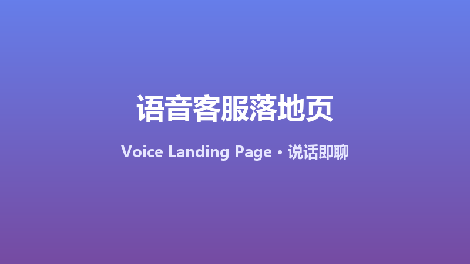

# 语音客服落地页生成器 Voice Landing Page

> **赛道**：Prompt　**作者**：谢东华
>
> WorkBuddy × Tencent EdgeOne AI Prompts × Skills 挑战赛 参赛作品

## 🎬 Demo



## 📌 作品信息

| 字段 | 内容 |
|---|---|
| 作品名称 | 语音客服落地页生成器 Voice Landing Page |
| 赛道 | Prompt |
| 作者 | 谢东华 |
| 类型 | 落地页 / 工具站 |
| 技术栈 | 原生 HTML + Web Speech API（零依赖，开箱即用） |

## 📝 作品介绍

一段提示词生成"能听会说"的 AI 客服落地页：用户点击麦克风说话，页面自动语音识别、智能回复、语音播报。适用于语音客服、产品语音导览、无障碍网站、AI 语音助理等场景。技术亮点：

- **零后端成本**：语音识别与合成全部使用浏览器原生 Web Speech API，无需任何服务器与 API Key
- **开箱即用**：单文件 HTML，双击即可运行，粘贴给 AI 编程工具即可生成并部署到 EdgeOne
- **移动端优先**：大按钮、波纹动画、音波反馈，适配手机语音场景
- **可扩展**：支持后续接入 EdgeOne 模型网关（`@makers/deepseek-v4-flash`）实现真正的 AI 自由对话

---

## 🚀 完整 Prompt（直接复制以下内容喂给 AI 编程工具）

````
请生成一个单页"语音 AI 客服"网站（文件名 index.html，纯原生 HTML/CSS/JS，不要框架，不要外部 CDN 依赖），要求：

【品牌】名称"小宝智能客服"，主色 #667eea 渐变到 #764ba2，白底卡片，现代圆润风格，移动端优先。

【功能】
1. 顶部：品牌 Logo（🤖 表情）+"小宝智能客服 · 说话即聊"标题，副标题"点击麦克风，用语音提问"
2. 中间：一个大圆形麦克风按钮（直径 96px，渐变背景，按下时缩放+波纹动画），下方状态文字（默认"点击开始说话"、录音中"正在聆听…"、识别中"正在思考…"）
3. 语音识别：用 window.SpeechRecognition || window.webkitSpeechRecognition，lang='zh-CN'，连续识别，onresult 获取文本
4. 语音播报：SpeechSynthesisUtterance，lang='zh-CN'，把回复内容播报出来
5. 智能回复逻辑：内置 FAQ 关键词匹配（规则表至少 8 条，覆盖：营业时间/价格/联系方式/退换货/物流/产品介绍/人工客服/默认兜底话术），匹配不到时回复"这个问题我记下了，稍后人工客服联系您"
6. 对话记录区：下方显示最近 6 条对话气泡（用户右侧蓝色，客服左侧白色带边框），自动滚动
7. 音波动画：录音时显示 5 条竖条跳动动画

【样式】渐变背景、卡片阴影、按钮悬停效果、动画平滑；中文用 -apple-system, "PingFang SC", "Microsoft YaHei"

【注意】不写任何 API Key；注释写清楚每个模块；代码完整可直接运行。

生成完成后：本地打开 index.html 验证（Chrome 桌面/安卓均可测试语音），然后按以下步骤部署到 EdgeOne：创建项目 → 直接上传 index.html → 选择"全球可用区（不含中国大陆）" → 部署后把线上 URL 发我。
````
