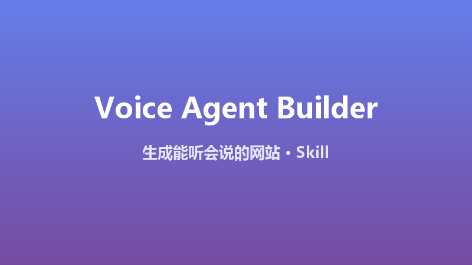

# Voice Agent Website Builder

> **赛道**：Skill　**作者**：谢东华
>
> WorkBuddy × Tencent EdgeOne AI Prompts × Skills 挑战赛 参赛作品

## 🎬 Demo



## 📌 作品信息

| 字段 | 内容 |
|---|---|
| 作品名称 | Voice Agent Website Builder |
| 赛道 | Skill |
| 作者 | 谢东华 |
| 版本 | 1.0.0 |

## 📝 作品介绍

Voice Agent Website Builder 是一个生成"能听会说"网站的建站 Skill——让 AI 编程工具按 SOP 生成带**语音输入 + 语音播报 + AI 回复**的现代网站，并引导部署到 EdgeOne。适用于：语音客服、语音导览、无障碍网站、AI 语音助理、智能硬件配套页等场景。

核心价值与亮点：

- **差异化**：AI 建站时代主流作品集中于视觉与功能，本 Skill 聚焦**语音交互**这一空白场景
- **零后端成本**：语音识别/合成用浏览器原生 Web Speech API，AI 回复可选用 EdgeOne 免费内置模型（`@makers/deepseek-v4-flash`，每月 50 万 token 免费额度）
- **开箱即用**：生成单文件 HTML 或标准框架项目，本地可调试（`edgeone makers dev`），一键部署
- **完整 SOP**：从需求确认 → 骨架生成 → 本地调试 → 部署上线 → 验收清单，全流程覆盖

---

## 🚀 完整 Skill 说明

````markdown
---
name: voice-agent-website-builder
description: 生成带语音交互能力的完整网站（语音输入 + 语音回复 + AI 客服）。触发词：语音网站、voice site、语音落地页、voice landing page、语音客服。使用本 Skill 后，AI 会生成一个含 Web Speech API 语音输入、语音合成播报、可接入 AI 模型网关的现代网站，并引导部署到 EdgeOne。
metadata:
  author: 谢东华
  version: "1.0.0"
---

# Voice Agent Website Builder

## 用途
生成一个「能听会说」的现代网站：用户用语音提问，网站用语音回复。适用于：语音客服、语音导览、语音落地页、无障碍网站、AI 语音助理等场景。

## 触发条件
当用户要求"做一个语音网站 / 语音落地页 / 语音客服 / voice site"时使用本 Skill。

## 工作流程

### Step 1 · 确认需求
向用户确认 3 个问题：
1. 网站主题/品牌名是什么？
2. 核心场景：客服问答 / 产品介绍 / 信息查询？
3. 是否需要 AI 大模型回复（可后续接入 EdgeOne 模型网关），还是仅固定话术播报？

### Step 2 · 生成网站骨架
生成单页 HTML（或 React/Vue，按用户偏好），必须包含：

1. **语音输入**（浏览器原生，零后端成本）：
```html
<button id="mic">🎤 说话</button>
<script>
const rec = new (window.SpeechRecognition || window.webkitSpeechRecognition)();
rec.lang = 'zh-CN';
rec.onresult = e => ask(e.results[0][0].transcript);
</script>
```

2. **语音播报**（TTS 播报回复）：
```js
function speak(text) {
  const u = new SpeechSynthesisUtterance(text);
  u.lang = 'zh-CN';
  speechSynthesis.speak(u);
}
```

3. **AI 回复**（二选一）：
- 方案 A（免费内置模型）：接入 EdgeOne 模型网关，使用 `MAKERS_MODELS_KEY` 环境变量 + `https://ai-gateway.edgeone.link`，模型 `@makers/deepseek-v4-flash`
- 方案 B（本地规则）：内置 FAQ 关键词匹配，不依赖外部 API

4. **视觉规范**：品牌色 + 渐变背景 + 大按钮（便于语音场景触控）+ 波形动画反馈

### Step 3 · 本地调试
```bash
npm install -g edgeone
edgeone login
edgeone makers dev   # http://localhost:8088
```
在浏览器中测试：点击麦克风 → 说话 → 网页播报回复。

### Step 4 · 部署到 EdgeOne
1. 控制台创建项目（加速区域选"全球可用区（不含中国大陆）"，无需备案）
2. 方式一：`edgeone makers deploy ./dist -n <project-name> -t <API_TOKEN>`
3. 方式二：推送 Git 仓库，控制台"导入 Git 仓库"自动构建
4. 部署后获得线上 URL，全球 3200+ 节点加速

### Step 5 · 验收清单
- [ ] 点击麦克风按钮可录音并识别中文语音
- [ ] 网页能语音播报回复内容
- [ ] 移动端浏览器可正常使用（Android Chrome / iOS Safari）
- [ ] 页面在 EdgeOne 上线，HTTPS 可访问

## 注意事项
- 语音识别依赖浏览器 `SpeechRecognition` API，iOS Safari 需 14.1+，微信内置浏览器可能不支持，建议提示用户用系统浏览器打开
- 如需更好的语音识别效果，可替换为 EdgeOne 模型网关 + 语音 API 或第三方 ASR
- 不包含真实 API Key；模型网关密钥使用平台环境变量注入
- 如用户需要"语音通话"（双向实时对话），提示其使用 LiveKit 等实时音视频方案
````
